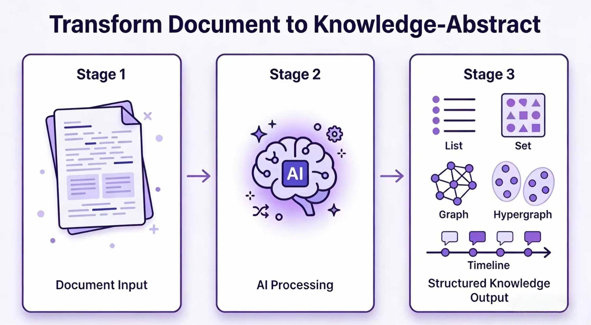
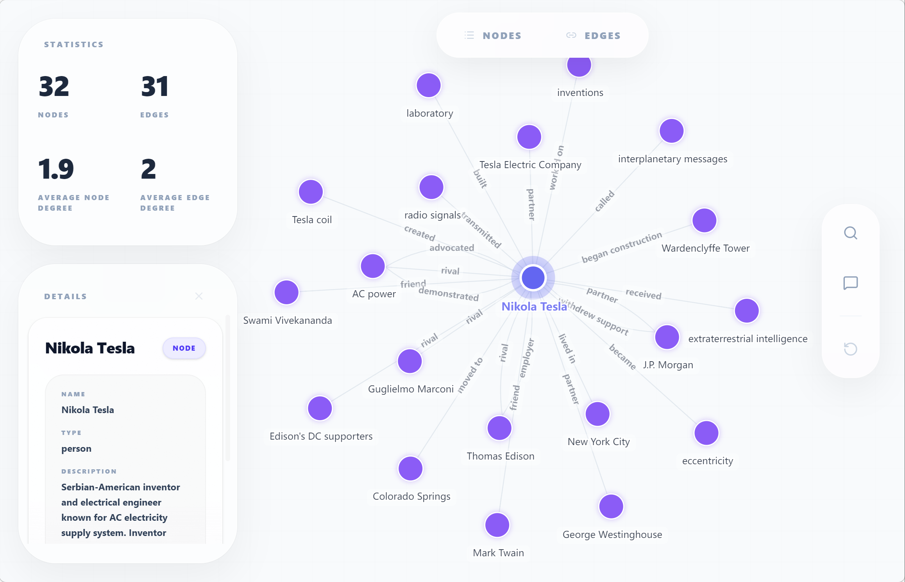
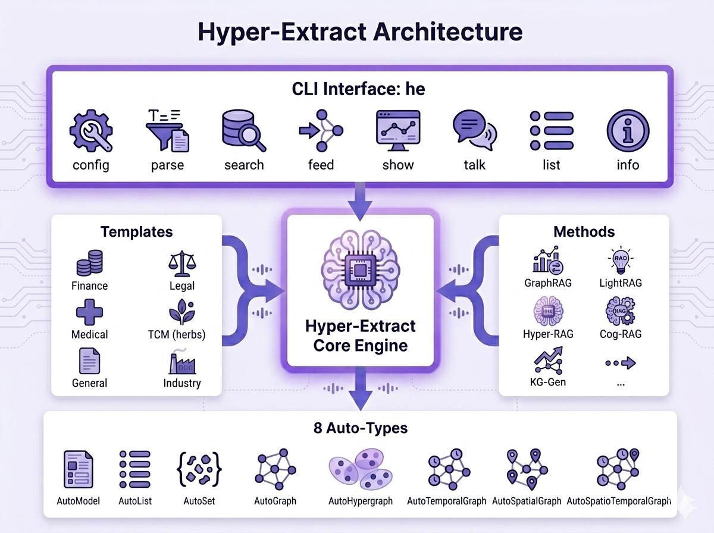

<div align="center">

# 🚀 Hyper-Extract

**Smart Knowledge Extraction CLI — Transform documents into structured knowledge with one command.**

[📖 English Version](./README.md) · [中文版](./README_ZH.md)

[](https://python.org)
[](LICENSE)
[]()

<br/>

> **"Stop reading. Start understanding."**  
> *"告别文档焦虑，让信息一目了然"*

<br/>



<br/>
</div>

Hyper-Extract is an intelligent, LLM-powered knowledge extraction and evolution framework. It radically simplifies transforming highly unstructured texts into persistent, predictable, and strongly-typed knowledge summaries. It effortlessly extracts information into a wide spectrum of formats—ranging from simple **Collections** (Lists/Sets) and **Pydantic Models**, to complex **Knowledge Graphs**, **Hypergraphs**, and even **Spatio-Temporal Graphs**.

## ✨ Core Features

- 🔷 **8 Auto-Types:** From basic `AutoModel`/`AutoList` to advanced `AutoGraph`, `AutoHypergraph`, and `AutoSpatioTemporalGraph`.
- 🧠 **10+ Extraction Engines:** Out-of-the-box support for cutting-edge retrieval paradigms like `GraphRAG`, `LightRAG`, `Hyper-RAG`, and `KG-Gen`.
- 📝 **Declarative YAML Templates:** Zero-code extraction definition. Includes 80+ presets across 6 domains.
- 🔄 **Incremental Evolution:** Feed new documents on the fly to continuously map out and expand the extracted knowledge.

***

## ⚡ Quick Start

### 1. Installation

```bash
uv pip install hyper-extract
```

### 2. The Command Line Way

Extract, search, and manage directly from CLI.

> By default, the CLI uses `gpt-4o-mini` and `text-embedding-3-small`.

```bash
# Configure OpenAI API Key
he config init -k YOUR_OPENAI_API_KEY

# Extract knowledge (using examples/en/tesla.md as sample input)
he parse examples/en/tesla.md -t general/biography_graph -o ./output/ -l en

# Query the knowledge base
he search ./output/ "What are Tesla's major achievements?"

# Incrementally supplement knowledge
he feed ./output/ another_tesla_document.md
```

<details>
<summary><b> The Python API Way</b></summary>
<br>

```python
from hyperextract import Template

ka = Template.create("general/biography_graph")
result = ka.parse(text)
```

> 🔗 For complete examples, see [examples/en](./examples/en/)

</details>

## 🧩 Deep Dive: The 8 Auto-Types

Our framework embraces complexity without making you write boilerplate code.

!\[Knowledge Structures Matrix]\(docs/assets/autotypes.png null)

### Example: AutoGraph Visualization

Here is the knowledge graph visualization after `AutoGraph` extraction:



## 🛠️ Architecture Overview

The system is built on a robust triad: **Auto-Types** (Multi-typed structures), **Methods** (The Execution strategy), and **Templates** (Declarative schema).



### 📋 Template Structure Example

Here's a complete YAML template example that defines a Knowledge Graph extraction:

```yaml
language: en

name: Knowledge Graph
type: graph
tags: [general]

description: 'Extract entities and their relationships to construct a knowledge graph.'

output:
  entities:
    fields:
    - name: name
      type: str
      description: 'Entity name'
    - name: type
      type: str
      description: 'Entity type'
  relations:
    fields:
    - name: source
      type: str
      description: 'Source entity'
    - name: target
      type: str
      description: 'Target entity'
    - name: type
      type: str
      description: 'Relation type'

guideline:
  target: 'Extract entities and their relationships from the text.'
  rules_for_entities:
    - 'Extract meaningful entities'
    - 'Maintain consistent naming'
  rules_for_relations:
    - 'Create relations only when explicitly expressed in the text'

identifiers:
  entity_id: name
  relation_id: '{source}|{type}|{target}'
  relation_members:
    source: source
    target: target

display:
  entity_label: '{name} ({type})'
  relation_label: '{type}'
```

### 📚 Related Documentation

- **Preset Templates**: Browse [80+ ready-to-use templates](./hyperextract/templates/presets/) across 6 domains
- **Design Guide**: Learn how to [create custom templates](./hyperextract/templates/DESIGN_GUIDE.md)

## 📈 Comparison with Other Libraries

| Feature          | GraphRAG | LightRAG | KG-Gen | ATOM | **Hyper-Extract** |
| ---------------- | :------: | :------: | :----: | :--: | :---------------: |
| Knowledge Graph  |     ✅    |     ✅    |    ✅   |   ✅  |         ✅         |
| Temporal Graph   |     ✅    |     ❌    |    ❌   |   ✅  |         ✅         |
| Spatial Graph    |     ❌    |     ❌    |    ❌   |   ❌  |         ✅         |
| Hypergraph       |     ❌    |     ❌    |    ❌   |   ❌  |         ✅         |
| Domain Templates |     ❌    |     ❌    |    ❌   |   ❌  |         ✅         |
| CLI Tool         |     ❌    |     ❌    |    ❌   |   ❌  |         ✅         |
| Multi-language   |  Partial |     ❌    |    ❌   |   ❌  |         ✅         |

## 📚 Related Documentation

- [Full Documentation](https://hyper-extract.github.io/en/) - Complete documentation site
- [中文文档](https://hyper-extract.github.io/zh/) - 中文文档
- [CLI Guide](https://hyper-extract.github.io/en/guides/cli/) - Command-line interface
- [Template Gallery](https://hyper-extract.github.io/en/reference/template-gallery/) - Available templates
- [Example Code](./examples/) - Working examples

## 🤝 Contributing & License

Contributions are welcome! Please submit Issues and PRs.
Licensed under **Apache-2.0**.
