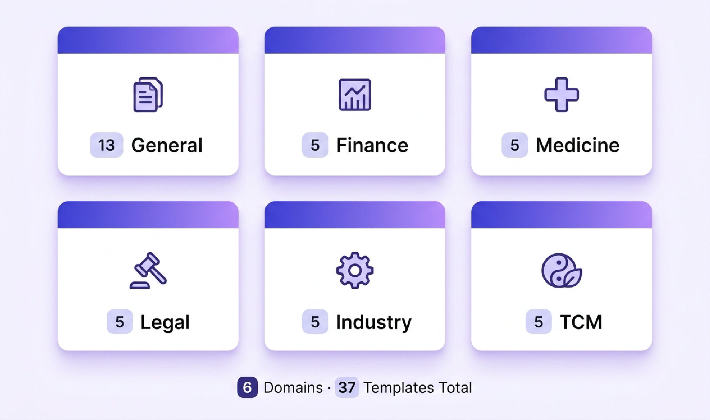

# 🔍 Hyper-Extract

> **"Stop reading. Start understanding."**
>
> *"告别文档焦虑，让信息一目了然"*

Transform documents into **knowledge abstracts** — with just one command.


[📖 English Version](./README.md) · [中文版](./README_ZH.md)

---

## ⚡ Quick Start

```bash
pip install hyper-extract

he config init
he parse document.md -o ka -l zh
he search ka "key insights"
```


---

## ⚙️ Quick Configuration

Before using Hyper-Extract, you need to configure your LLM and Embedder:

### Interactive Setup (Recommended)

```bash
he config init
```

This will guide you through setting up:
1. LLM configuration (model, API key, base URL)
2. Embedder configuration (model, API key, base URL)

### Manual Configuration

#### Configure LLM

```bash
he config llm --api-key YOUR_API_KEY
he config llm --model gpt-4o --api-key YOUR_API_KEY --base-url https://api.openai.com/v1
```

#### Configure Embedder

```bash
he config embedder --api-key YOUR_API_KEY
he config embedder --model text-embedding-3-small --api-key YOUR_API_KEY
```

### Environment Variables

```bash
export OPENAI_API_KEY=your_api_key
export OPENAI_BASE_URL=https://api.openai.com/v1
```

Environment variables take precedence over config file settings.

### View Current Configuration

```bash
he config show
```

---

## 🧩 Knowledge Abstract Types


8 structures for extracting different types of information:

**Record Types:**
| Structure | Best For | Example |
|-----------|----------|---------|
| AutoModel | Structured reports | Financial statements |
| AutoList | Key points | Meeting notes |
| AutoSet | Entity collection | Product catalog |

**Graph Types:**
| Structure | Best For | Example |
|-----------|----------|---------|
| AutoGraph | Binary relations | Social networks |
| AutoHypergraph | Multi-party events | Legal disputes |
| AutoTemporalGraph | Event sequences | News timeline |
| AutoSpatialGraph | Locations | Delivery routes |
| AutoSpatioTemporalGraph | Events in time & space | Historical battles |

### Comparison with Other Libraries

| Feature | KG-Gen | ATOM | Graphiti | LightRAG | Hyper-Extract |
|---------|--------|------|----------|----------|---------------|
| Knowledge Graph | ✅ | ✅ | ❌ | ✅ | ✅ |
| Temporal Graph | ❌ | ✅ | ✅ | ❌ | ✅ |
| Spatial Graph | ❌ | ❌ | ❌ | ❌ | ✅ |
| Hypergraph | ❌ | ❌ | ❌ | ❌ | ✅ |
| Templates | ❌ | ❌ | ❌ | ❌ | ✅ |
| CLI Tool | ❌ | ❌ | ❌ | ❌ | ✅ |

---

## 🌍 Domain Templates



Pre-built templates for common domains:

| Domain | Templates | Scenarios |
|--------|-----------|-----------|
| General | 13 | Workflow, Biography, Concept maps |
| Finance | 5 | Earnings reports, Risk factors |
| Medicine | 5 | Clinical records, Drug interactions |
| TCM | 5 | Formula composition, Meridian flow |
| Industry | 5 | Equipment topology, Failure analysis |
| Legal | 5 | Contract clauses, Case citations |

**Total: 6 Domains · 37 Templates**

See [Template Gallery](hyperextract/templates/) for all templates.

---

## 💻 CLI Reference

### Parse Command

```bash
he parse document.md -o my_ka -l zh
he parse document.md -o my_ka -t general/knowledge_graph -l zh
```

### Build Search Index

```bash
he build-index my_ka
```

### Search Knowledge Abstract

```bash
he search my_ka "What are the key findings?"
he search my_ka "key insights" -n 5
```

### Visualize

```bash
he show my_ka
he info my_ka
```

For full CLI documentation, see [CLI Guide](hyperextract/cli/README.md).

---

## 📚 Documentation

- [📖 Full Documentation](docs/)
- [💻 Examples](examples/)
- [🏷️ Template Gallery](hyperextract/templates/)
- [🖥️ CLI Guide](hyperextract/cli/README.md)
