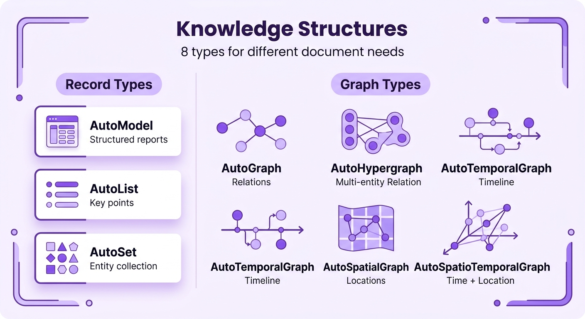
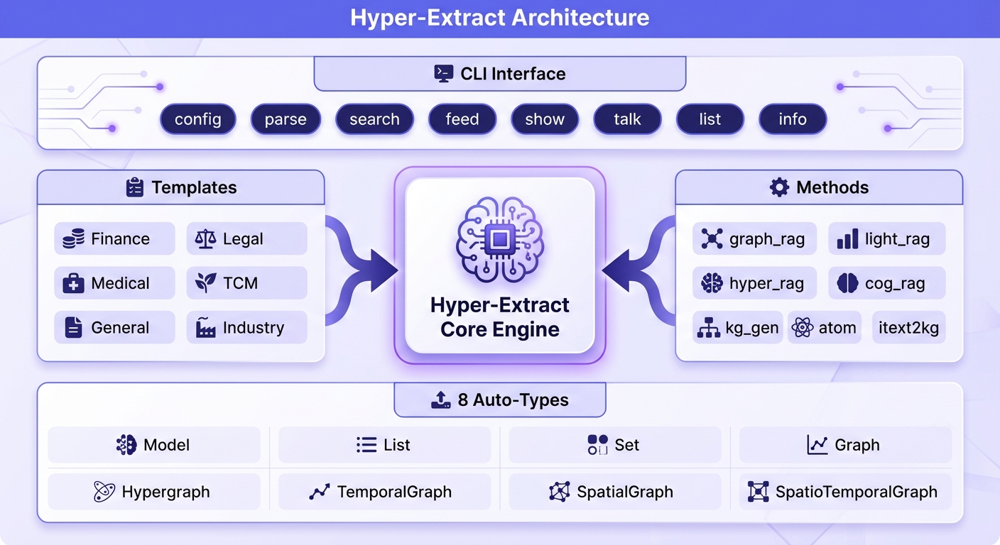

# Hyper-Extract

[📖 English Version](./README.md) · [中文版](./README_ZH.md)

> **"Stop reading. Start understanding."**

> *"告别文档焦虑，让信息一目了然"*

**Transform documents into knowledge abstracts — with just one command.**

[](https://python.org)
[](LICENSE)
[]()

## 🚀 What is Hyper-Extract?

Hyper-Extract is an intelligent, LLM-powered knowledge extraction and evolution framework. It radically simplifies transforming highly unstructured texts into persistent, predictable, and strongly-typed knowledge summaries. It effortlessly extracts information into a wide spectrum of formats—ranging from simple **Collections** (Lists/Sets) and **Pydantic Models**, to complex **Knowledge Graphs**, **Hypergraphs**, and even **Spatio-Temporal Graphs**.


## ✨ Core Features

- 🔷 **8 Auto-Types:** From basic `AutoModel`/`AutoList` to advanced `AutoGraph`, `AutoHypergraph`, and `AutoSpatioTemporalGraph`.
- 🧠 **10+ Extraction Engines:** Out-of-the-box support for cutting-edge retrieval paradigms like `graph_rag`, `light_rag`, and `hyper_rag`.
- 📝 **Declarative YAML Templates:** Zero-code extraction definition. Includes 80+ presets across 6 domains.
- 🔄 **Incremental Evolution:** Feed new documents on the fly to continuously map out and expand the extracted knowledge.

---

## ⚡ Quick Start

### 1. Installation

```bash
uv pip install hyper-extract
```

### 2. The Command Line Way

Extract, search, and manage directly from CLI.

> By default, the CLI uses `gpt-4o-mini` and `text-embedding-3-small`.

```bash
he config init -k YOUR_API_KEY
he parse document.md -o ./output/ -l zh
he search ./output/ "What are the key events?"
he feed ./output/ new_document.md
```

<details>
<summary><b>🛠️ How to define a Knowledge Template (YAML)?</b></summary>
<br>

Zero-code approach to define what to extract from incoming texts:

```yaml
name: Event Timeline
description: Extract financial events and their temporal relations.
type: TemporalGraph
schema:
  nodes:
    - type: Event
      properties:
        - name: description
          type: string
  edges:
    - type: Timeline
      source: Event
      target: Event
      properties:
        - name: relation
          type: string
```
</details>

### 3. The Python API Way

```python
from hyperextract import Template

# Load a preset YAML template
ka = Template.create("finance/event_timeline")

# Extract and auto-parse the document
result = ka.parse(annual_report_text)
```

> 🔗 For complete examples, see [examples/en](./examples/en/)

## 🧩 Deep Dive: The 8 Auto-Types

Our framework embraces complexity without making you write boilerplate code. 



## 🛠️ Architecture Overview

The system is built on a robust triad: **Auto-Types** (Multi-typed structures), **Methods** (The Execution strategy), and **Templates** (Declarative schema).



* **Design Guide**: [Template Design Guide](./hyperextract/templates/DESIGN_GUIDE.md)
* **Preset Templates**: [presets directory](./hyperextract/templates/presets/)

## 📈 Comparison with Other Libraries

| Feature | GraphRAG | LightRAG | KG-Gen | ATOM | **Hyper-Extract** |
|---------|:---:|:---:|:---:|:---:|:---:|
| Knowledge Graph | ✅ | ✅ | ✅ | ✅ | ✅ |
| Temporal Graph | ✅ | ❌ | ❌ | ✅ | ✅ |
| Spatial Graph | ❌ | ❌ | ❌ | ❌ | ✅ |
| Hypergraph | ❌ | ❌ | ❌ | ❌ | ✅ |
| Domain Templates | ❌ | ❌ | ❌ | ❌ | ✅ |
| CLI Tool | ❌ | ❌ | ❌ | ❌ | ✅ |
| Multi-language | Partial | ❌ | ❌ | ❌ | ✅ |

## 📚 Related Documentation

* [Full Documentation](https://hyper-extract.github.io/en/) - Complete documentation site
* [中文文档](https://hyper-extract.github.io/zh/) - 中文文档
* [CLI Guide](https://hyper-extract.github.io/en/guides/cli/) - Command-line interface
* [Template Gallery](https://hyper-extract.github.io/en/reference/template-gallery/) - Available templates
* [Example Code](./examples/) - Working examples

## 🤝 Contributing & License

Contributions are welcome! Please submit Issues and PRs.
Licensed under **Apache-2.0**.
