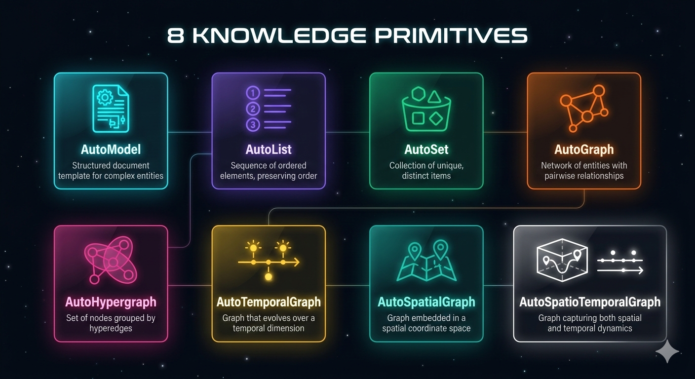

# Hyper-Extract

[中文版](./README_ZH.md) · [English Version](#)

---

<!-- Architecture Diagram -->


---

## "Chat solved. What's next is Knowledge."

Transform LLM output from scattered text into **searchable, queryable, and reasoning-enabled** structured knowledge.

---

## ❌ Before | ✅ After

<!-- Concept Diagram -->


| Before | After |
| :--- | :--- |
| LLM outputs a wall of text | Structured knowledge output |
| ❌ Answer disappears after chat | ✅ Persistent storage |
| ❌ Can't search precisely | ✅ Precise search |
| ❌ Can't trace the source | ✅ Traceable provenance |
| ❌ Fragmented, can't reuse | ✅ Knowledge accumulates |

---

## 🧩 8 AutoTypes

<!-- AutoTypes Diagram -->


| Type | Icon | What it does |
| :--- | :---: | :--- |
| **AutoModel** | 📋 | Extract into a complete data model |
| **AutoList** | 📝 | Extract as a list (keywords, items) |
| **AutoSet** | 📦 | Extract and deduplicate (entity registry) |
| **AutoGraph** | 🔗 | Extract as a knowledge graph (relations) |
| **AutoTemporalGraph** | ⏱️ | Extract as timeline (events over time) |
| **AutoSpatialGraph** | 📍 | Extract as spatial graph (locations) |
| **AutoSpatioTemporalGraph** | 🌏 | Extract as spatiotemporal graph (time + space) |
| **AutoHypergraph** | 🌐 | Extract as hypergraph (multi-party relations) |

---

## 🔬 Method Comparison

| Method | Type | Model | List | Set | Graph | Temporal | Spatial | Spatiotemporal | Hypergraph |
| :--- | :---: | :---: | :---: | :---: | :---: | :---: | :---: | :---: | :---: |
| **KG-Gen** | Graph | ❌ | ❌ | ❌ | ✅ | ❌ | ❌ | ❌ | ❌ |
| **ATOM** | Atomic | ❌ | ❌ | ❌ | ✅ | ✅ | ❌ | ❌ | ❌ |
| **Graphiti** | Temporal | ❌ | ❌ | ❌ | ❌ | ✅ | ❌ | ❌ | ❌ |
| **LightRAG** | Graph | ❌ | ❌ | ❌ | ✅ | ❌ | ❌ | ❌ | ❌ |
| **Hyper-RAG** | Hypergraph | ❌ | ❌ | ❌ | ❌ | ❌ | ❌ | ❌ | ✅ |
| **Hyper-Extract** | All-in-One | ✅ | ✅ | ✅ | ✅ | ✅ | ✅ | ✅ | ✅ |

---

## 🌍 12 Domains, 200+ Templates

| Domain | Templates | Domain | Templates |
| :--- | :---: | :--- | :---: |
| 💰 Finance | 25+ | 📜 History | 12+ |
| 🏥 Medicine | 20+ | 🧬 Biology | 10+ |
| ⚖️ Legal | 15+ | 🎭 Literature | 10+ |
| 🌿 TCM | 15+ | 📰 News | 12+ |
| 🔧 Industry | 18+ | 🌾 Agriculture | 8+ |
| 🍜 Food | 8+ | 🌐 General | 20+ |

---

## 🚀 Quick Start

### Option 1: Using YAML Config (Recommended)

```python
from hyperextract.utils.template_engine import Gallery, TemplateFactory
from langchain_openai import ChatOpenAI, OpenAIEmbeddings

llm = ChatOpenAI(model="gpt-4o-mini")
embedder = OpenAIEmbeddings()

# Get template (auto-loaded presets and customs)
config = Gallery.get("ResearchNoteSummary")

# Create template
template = TemplateFactory.create(config, llm, embedder)
result = template.parse("Apple Q3 revenue reached $94.9 billion...")

answer = template.chat("What drove the revenue growth?")
print(answer.content)
```

### Option 2: Using Python Class (Deprecated)

```python
from hyperextract.templates.legacy.en.finance import ResearchNoteSummary
from langchain_openai import ChatOpenAI, OpenAIEmbeddings

llm = ChatOpenAI(model="gpt-4o-mini")
embedder = OpenAIEmbeddings()

template = ResearchNoteSummary(llm_client=llm, embedder=embedder)
result = template.parse("Apple Q3 revenue reached $94.9 billion...")

answer = template.chat("What drove the revenue growth?")
print(answer.content)
```

---

## 🔧 Architecture

<details>
<summary><strong>Technical Details</strong></summary>

```
hyperextract/
├── types/                    # 8 AutoTypes
│   ├── model.py             # AutoModel
│   ├── list.py              # AutoList
│   ├── set.py               # AutoSet
│   ├── graph.py             # AutoGraph
│   ├── hypergraph.py        # AutoHypergraph
│   ├── temporal_graph.py    # AutoTemporalGraph
│   ├── spatial_graph.py     # AutoSpatialGraph
│   └── spatio_temporal_graph.py  # AutoSpatioTemporalGraph
│
├── methods/                  # Extraction Engines
│   ├── rag/                 # RAG methods
│   │   ├── light_rag.py
│   │   ├── hyper_rag.py
│   │   └── cog_rag.py
│   └── typical/             # Reproduced methods
│       ├── kg_gen.py        # KG-Gen
│       └── atom.py          # ATOM
│
└── templates/                # Domain Templates
    ├── zh/                  # Chinese templates
    │   ├── finance/         # 25+ templates
    │   ├── medicine/        # 20+ templates
    │   └── ...
    └── en/                  # English templates
```

</details>

---

## 📚 Documentation & Resources

- [📖 Full Documentation](docs/)
- [💻 Examples](examples/)
- [🏷️ Template Gallery](hyperextract/templates/)

---

## 🤝 Contributing

Welcome! Please feel free to submit issues and pull requests.

---

## ⭐ Support

If you find this project helpful, please give us a ⭐ to show your support!

---

*Built with ❤️ for the AI Community*
