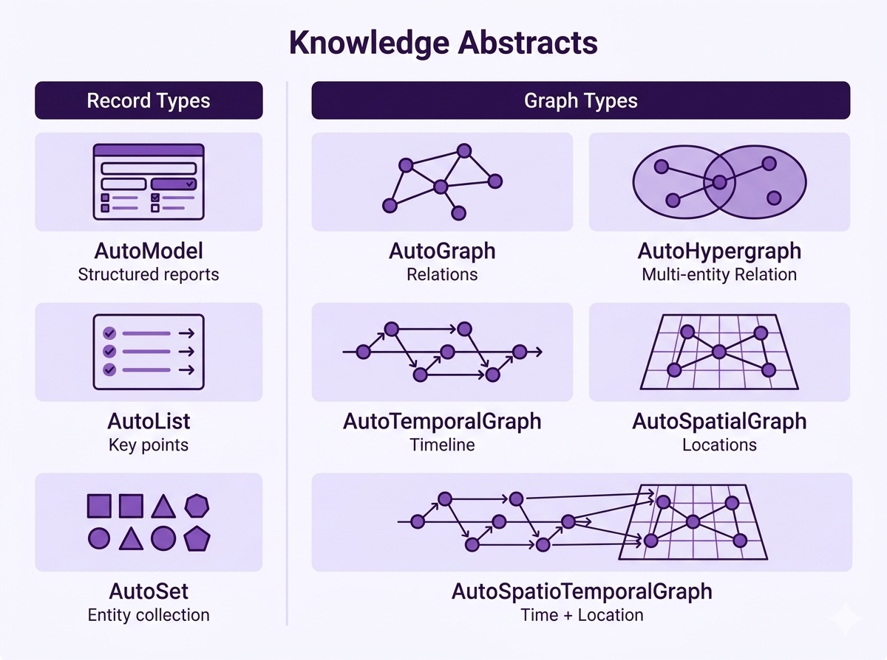
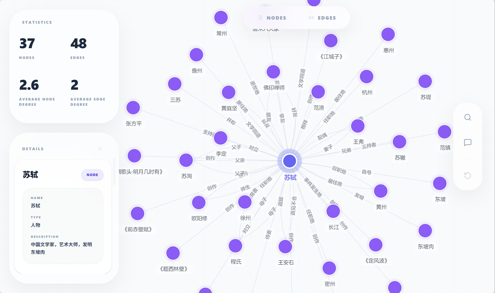
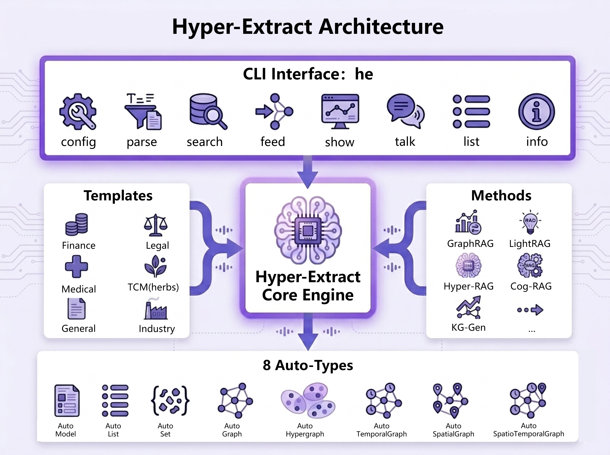

<div align="center">

<a href="https://yifanfeng97.github.io/Hyper-Extract/latest/zh/">
<picture>
  <source media="(prefers-color-scheme: dark)" srcset="docs/assets/logo/logo-horizontal-dark.svg">
  <source media="(prefers-color-scheme: light)" srcset="docs/assets/logo/logo-horizontal.svg">
  
</picture>
</a>

<br/>
<br/>

**智能知识提取 CLI**

**一行命令，将文档转化为结构化知识。**

[📖 English Version](./README.md) · [中文版](./README_ZH.md)

[](https://pypi.org/project/hyperextract/)
[](https://python.org)
[](LICENSE)
[]()
[](https://yifanfeng97.github.io/Hyper-Extract/latest/zh/)

<br/>

> **"Stop reading. Start understanding."**  
> *"告别文档焦虑，让信息一目了然"*

<br/>


<br/>
</div>

Hyper-Extract 是一个智能的、由大语言模型（LLM）驱动的知识提取与演进框架。它极大地简化了将杂乱不堪的文本转化为持久化、强类型的**知识摘要（Knowledge Abstracts）**的过程。无论从基础的**集合（Collection/List）和**结构化模型（Model），还是到高阶复杂的**知识图谱（Knowledge Graph）**、**超图（Hypergraph）**，甚至是**时空图谱（Spatio-Temporal Graph）**，它都能轻松拿捏。

## ✨ 核心亮点

- 🔷 **8大基础知识结构数据结构（Auto-Types）：** 从基础的 `AutoModel`/`AutoList` 到高阶的 `AutoGraph`, `AutoHypergraph`, 以及 `AutoSpatioTemporalGraph`（时空图）。
- 🧠 **10+ 前沿提取引擎：** 开箱即用整合了业界顶尖的检索范式，例如 `GraphRAG`、`LightRAG`、`Hyper-RAG` 和 `KG-Gen`。
- 📝 **声明式 YAML 模板：** 零代码定义提取策略。内置覆盖 6 大领域的 80+ 预设模板。
- 🔄 **知识增量演进：** 支持动态喂入新文档（Feed），让提取的知识图谱自动补全和扩展。

***

## ⚡ 快速上手

### 1. 安装

**CLI 用户**（全局安装 `he` 命令）：

```bash
uv tool install hyperextract
```

**Python 开发者**（作为库使用）：

```bash
uv pip install hyperextract
```

### 2. CLI 命令行玩法

仅仅几行命令体验最纯粹的知识交互。

> 默认采用`gpt-4o-mini` 作为大模型基座， `text-embedding-3-small`作为文本嵌入模型。

```bash
# 配置 OpenAI API Key
he config init -k YOUR_OPENAI_API_KEY

# 提取知识
he parse examples/zh/sushi.md -t general/biography_graph -o ./output/ -l zh

# 查询知识摘要
he search ./output/ "苏轼有哪些重要的作品？"

# 可视化知识图谱
he show ./output/

# 增量补充知识
he feed ./output/ examples/zh/sushi_question.md

# 展示更新后的知识图谱
he show ./output/
```

<details>
<summary><b>🐍 Python API 深度集成</b>（点击展开）</summary>
<br>

### 安装

```bash
# 克隆仓库
git clone https://github.com/yifanfeng97/hyper-extract.git
cd hyper-extract

# 安装依赖
uv sync
```

### 配置

```bash
# 复制示例配置文件
cp .env.example .env

# 编辑 .env 文件，填入你的 API Key 和 Base URL
# OPENAI_API_KEY=your-api-key
# OPENAI_BASE_URL=https://api.openai.com/v1
```

### 使用

```python
import os
from dotenv import load_dotenv

# 从 .env 文件加载环境变量
load_dotenv()

from hyperextract import Template

# 创建模板
ka = Template.create("general/biography_graph")

# 解析文档
with open("examples/zh/sushi.md", "r", encoding="utf-8") as f:
    text = f.read()
result = ka.parse(text)

# 可视化知识图谱
ka.show(result)

# 增量补充知识
with open("examples/zh/sushi_question.md", "r", encoding="utf-8") as f:
    new_text = f.read()
ka.feed(result, new_text)

# 展示更新后的知识图谱
ka.show(result)
```

> 🔗 完整示例代码，请参阅 [examples/zh](./examples/zh/)

</details>

<br>

**安装方式对比：**

| 使用场景 | 命令 | 说明 |
|----------|------|------|
| CLI 工具 | `uv tool install hyperextract` | 全局安装 `he` 命令 |
| Python 库 | `uv pip install hyperextract` | 在 Python 代码中使用 |

## 🧩 8 种核心知识结构

拒绝样板代码，纯干货聚焦数据本身。



### 示例：AutoGraph 知识图谱可视化

以下是 `AutoGraph` 类型提取后的知识图谱可视化效果：



## 🛠️ 系统架构

Hyper-Extract 采用**三层架构**：

- **Auto-Types** 定义了知识提取的数据结构。8 种强类型结构（AutoModel、AutoList、AutoSet、AutoGraph、AutoHypergraph、AutoTemporalGraph、AutoSpatialGraph、AutoSpatioTemporalGraph）作为所有提取的输出格式。

- **Methods** 基于 Auto-Types 提供提取算法。包括典型方法（KG-Gen、iText2KG、iText2KG*）和 RAG 增强方法（GraphRAG、LightRAG、Hyper-RAG、HypergraphRAG、Cog-RAG）。

- **Templates** 提供领域特定的配置，包含开箱即用的 prompt 和数据结构。覆盖 6 大领域（金融、法律、医疗、中医、工业、通用），提供 80+ 预设模板，用户无需了解底层 Auto-Types 和 Methods 即可直接使用。

可通过 **CLI**（`he parse`、`he search`、`he show`...）或 **Python API**（`Template.create()`）使用。



### 📝 相关文档

- **预设模板**: 浏览覆盖 6 大领域的 [80+ 即用型模板](./hyperextract/templates/presets/)
- **设计指南**: 学习如何[创建自定义模板](./hyperextract/templates/DESIGN_GUIDE_ZH.md)

<details>
<summary><b>📋 模板结构示例 (Graph 类型)</b></summary>

以下是一个完整的 YAML 模板示例，用于 **Graph** 类型（实体关系）提取：

```yaml
language: zh

name: 知识图谱
type: graph
tags: [general]

description: '从文本中提取实体及其关系，构建知识图谱。'

output:
  entities:
    fields:
    - name: name
      type: str
      description: '实体名称'
    - name: type
      type: str
      description: '实体类型：如人物、组织、事件等'
    - name: description
      type: str
      description: '实体的详细介绍'
  relations:
    fields:
    - name: source
      type: str
      description: '源实体'
    - name: target
      type: str
      description: '目标实体'
    - name: type
      type: str
      description: '关系类型：如发明、合作、竞争等'
    - name: description
      type: str
      description: '关系的详细介绍'

guideline:
  target: '从文本中提取实体及其关系。'
  rules_for_entities:
    - '提取有意义的实体'
    - '保持命名一致'
  rules_for_relations:
    - '仅在文本明确表达时创建关系'

identifiers:
  entity_id: name
  relation_id: '{source}|{type}|{target}'
  relation_members:
    source: source
    target: target

display:
  entity_label: '{name} ({type})'
  relation_label: '{type}'
```

</details>

## 📈 与其他相关库的对比

| 特性      | GraphRAG | LightRAG | KG-Gen | ATOM | **Hyper-Extract** |
| ------- | :------: | :------: | :----: | :--: | :---------------: |
| 知识图谱支持  |     ✅    |     ✅    |    ✅   |   ✅  |         ✅         |
| 时序图谱    |     ✅    |     ❌    |    ❌   |   ✅  |         ✅         |
| 空间图谱    |     ❌    |     ❌    |    ❌   |   ❌  |         ✅         |
| 超图提取    |     ❌    |     ❌    |    ❌   |   ❌  |         ✅         |
| 领域模板驱动  |     ❌    |     ❌    |    ❌   |   ❌  |         ✅         |
| 交互式 CLI |     ✅    |     ❌    |    ❌   |   ❌  |         ✅         |
| 多语言支持   |     ✅    |     ❌    |    ❌   |   ❌  |         ✅         |


## 📚 相关文档

- [完整文档](https://yifanfeng97.github.io/Hyper-Extract/latest/zh/) - 完整文档站点
- [CLI 指南](https://yifanfeng97.github.io/Hyper-Extract/latest/zh/cli/) - 命令行界面
- [模板画廊](./hyperextract/templates/presets/) - 可用模板
- [示例代码](./examples/) - 可运行示例

## 🤝 参与贡献与协议

热烈欢迎社区提交 Issues 和 PRs。
项目基于 **Apache-2.0** 协议开源。

## ⭐ Star 历史趋势

[](https://star-history.com/#yifanfeng97/Hyper-Extract&Date)
