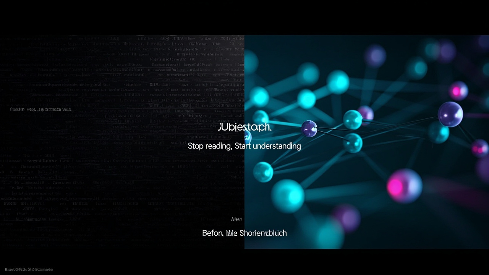
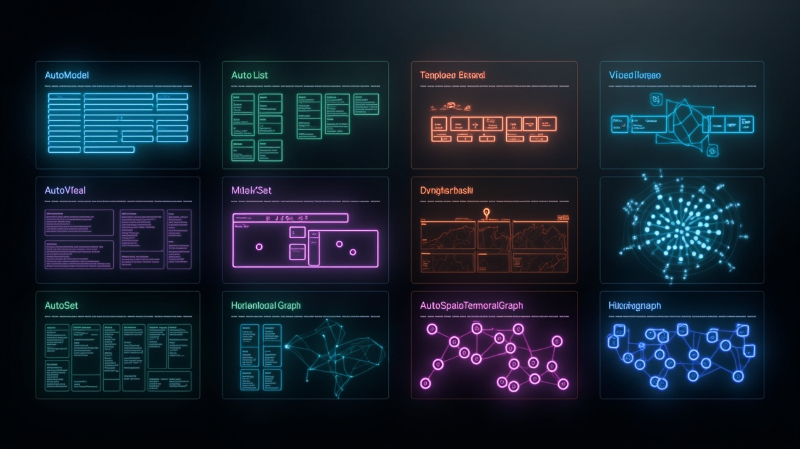

# 🔍 Hyper-Extract

> **"告别文档焦虑，让信息一目了然"**
>
> *"Stop reading. Start understanding."*

将非结构化文档转化为**可搜索、可视化、结构化**的知识 —— 一行命令即可。

[📖 English Version](./README.md) · [中文版](#)

---

## ✨ 核心特性

| 特性 | 说明 |
|------|------|
| ⚡ **CLI 优先** | 一条命令提取任何文档的知识 |
| 🎯 **8 种结构** | 知识图谱、时间线、空间图、超图... |
| 👁️ **可视化** | 使用 OntoSight 进行交互式可视化 |
| 🔍 **可搜索** | 语义搜索所有知识 |
| 🌐 **双语支持** | 完整支持中文和英文 |
| 📦 **200+ 模板** | 开箱即用的领域模板 |

---

## ❌ 以前 | ✅ 现在

| 以前 | 现在 |
|------|------|
| 密密麻麻的文字 | **清晰的结构** |
| ❌ 花几小时阅读 | ✅ **即时清晰** |
| ❌ 找不到关键信息 | ✅ **语义搜索** |
| ❌ 无法对比文档 | ✅ **结构化对比** |
| ❌ 洞察碎片化 | ✅ **知识沉淀** |



---

## ⚡ 快速开始

### 安装

```bash
pip install hyper-extract
```

### 使用

```bash
# 从文档提取结构
he parse document.pdf -o kb

# 可视化知识
he show kb

# 语义搜索
he search kb "关键信息"

# 交互式问答
he talk kb -i
```


---

## 🧩 8 种知识结构

**8 种不同结构**，满足不同需求：

| 类型 | 图标 | 适用场景 | 示例 |
|------|------|----------|------|
| **AutoModel** | 📋 | 结构化报告 | 财务报表 |
| **AutoList** | 📝 | 要点提取 | 会议记录 |
| **AutoSet** | 📦 | 实体注册 | 产品目录 |
| **AutoGraph** | 🔗 | 关系分析 | 社交网络 |
| **AutoTemporalGraph** | ⏱️ | 事件序列 | 新闻时间线 |
| **AutoSpatialGraph** | 📍 | 地理位置 | 配送路线 |
| **AutoSpatioTemporalGraph** | 🌏 | 时间+空间 | 历史事件 |
| **AutoHypergraph** | 🌐 | 复杂关系 | 法律案件 |



---

## 🎯 使用场景

| 领域 | 你将获得 | 示例 |
|------|----------|------|
| 📊 **财务** | 从财报中提取洞察 | `he parse report.pdf -o kb -l en` |
| ⚖️ **法律** | 结构化合同、法条 | `he parse contract.pdf -o kb -t hypergraph` |
| 🏥 **医疗** | 整理病历、治疗方案 | `he parse records.pdf -o kb` |
| 📚 **研究** | 从论文中提取关键发现 | `he parse paper.pdf -o kb` |
| 📋 **会议** | 转化为可操作的洞察 | `he parse notes.md -o kb` |


---

## 🔧 架构

<details>
<summary><strong>技术细节（点击展开）</strong></summary>

```
hyper-extract/
├── cli/                      # 💻 CLI 接口 (he 命令)
│   ├── commands/            # parse, talk, search, show...
│   └── __main__.py          # 入口点
│
├── types/                    # 🧩 8 种知识结构
│   ├── model.py             # AutoModel
│   ├── list.py              # AutoList
│   ├── set.py               # AutoSet
│   ├── graph.py             # AutoGraph
│   ├── hypergraph.py        # AutoHypergraph
│   ├── temporal_graph.py    # AutoTemporalGraph
│   ├── spatial_graph.py     # AutoSpatialGraph
│   └── spatio_temporal_graph.py
│
├── methods/                  # 🔬 提取引擎
│   ├── rag/                 # LightRAG, HyperRAG, CogRAG
│   └── typical/             # KG-Gen, ATOM
│
└── templates/                # 🌍 200+ 领域模板
    ├── zh/                  # 中文模板
    └── en/                  # 英文模板
```

### 支持的方法

| 方法 | 图谱 | 时序 | 空间 | 超图 |
|------|------|------|------|------|
| KG-Gen | ✅ | ❌ | ❌ | ❌ |
| ATOM | ✅ | ✅ | ❌ | ❌ |
| Graphiti | ❌ | ✅ | ❌ | ❌ |
| LightRAG | ✅ | ❌ | ❌ | ❌ |
| Hyper-RAG | ❌ | ❌ | ❌ | ✅ |
| **Hyper-Extract** | ✅ | ✅ | ✅ | ✅ |

</details>

---

## 📚 文档与资源

- [📖 完整文档](docs/)
- [💻 示例代码](examples/)
- [🏷️ 模板库](hyperextract/templates/)

---

## 🤝 贡献与支持

欢迎提交 Issue 和 Pull Request！

如果这个项目对你有帮助，请给我们一个 ⭐！

---

*为 AI 社区而构建 ❤️*
