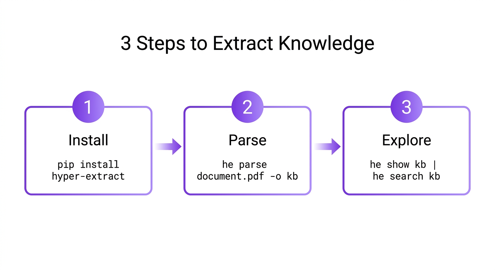
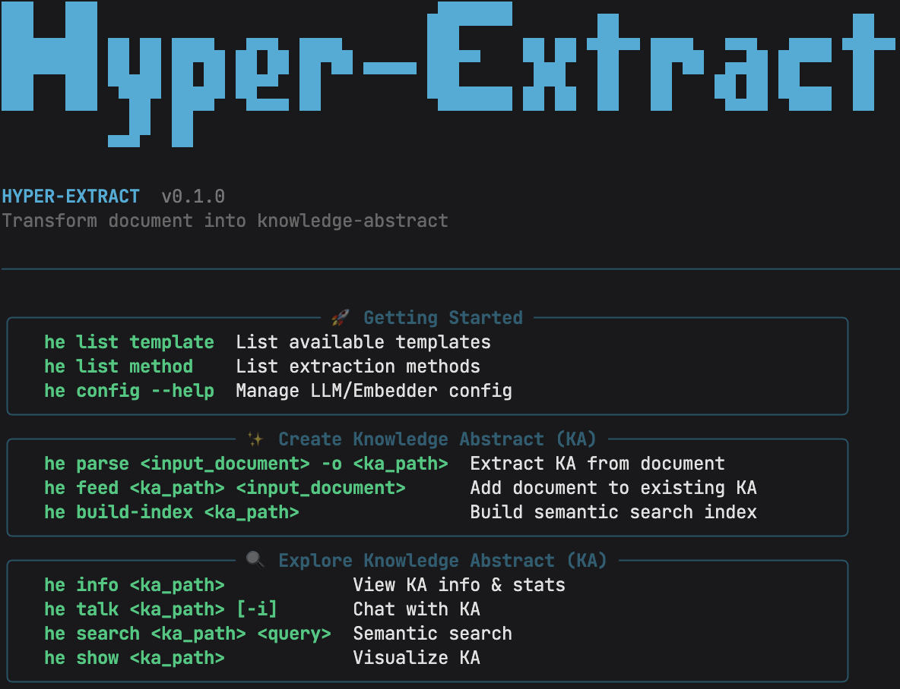

# 🔍 Hyper-Extract

> **"告别文档焦虑，让信息一目了然"**
>
> *"Stop reading. Start understanding."*

将非结构化文档转化为**可搜索、可视化、结构化**的知识 —— 一行命令即可。

[📖 English Version](./README.md) · [中文版](#)



---

## ⚡ 快速开始

```bash
pip install hyper-extract

he parse document.md -o kb
he show kb
he search kb "关键信息"
```



---

## 🧩 知识结构


8 种知识结构，满足不同文档类型：

**标量类型：**
| 结构 | 适用场景 | 示例 |
|------|----------|------|
| AutoModel | 结构化报告 | 财务报表 |
| AutoList | 要点列表 | 会议记录 |
| AutoSet | 实体集合 | 产品目录 |

**图类型：**
| 结构 | 适用场景 | 示例 |
|------|----------|------|
| AutoGraph | 二元关系 | 社交网络 |
| AutoHypergraph | 多方事件 | 法律纠纷 |
| AutoTemporalGraph | 事件序列 | 新闻时间线 |
| AutoSpatialGraph | 地理位置 | 配送路线 |
| AutoSpatioTemporalGraph | 时空事件 | 历史战役 |

### 与其他库的对比

| 功能 | KG-Gen | ATOM | Graphiti | LightRAG | Hyper-Extract |
|------|--------|------|----------|----------|---------------|
| 知识图谱 | ✅ | ✅ | ❌ | ✅ | ✅ |
| 时序图谱 | ❌ | ✅ | ✅ | ❌ | ✅ |
| 空间图谱 | ❌ | ❌ | ❌ | ❌ | ✅ |
| 超图 | ❌ | ❌ | ❌ | ❌ | ✅ |
| 模板 | ❌ | ❌ | ❌ | ❌ | ✅ |
| CLI 工具 | ❌ | ❌ | ❌ | ❌ | ✅ |

---

## 🌍 领域模板


开箱即用的领域模板：

| 领域 | 模板 |
|------|------|
| 金融 | 财报、股权结构、风险因子 |
| 法律 | 合同、法条、合规要求 |
| 医疗 | 临床记录、药理学、治疗方案 |
| 工业 | 设备规格、事故报告、安全规程 |
| 通用 | 会议记录、文章、研究论文 |
| 中医 | 中药方剂、经络流转、证候推理 |

查看 [模板库](hyperextract/templates/) 获取所有模板。

---

## 📚 文档

- [📖 完整文档](docs/)
- [💻 示例代码](examples/)
- [🏷️ 模板库](hyperextract/templates/)

