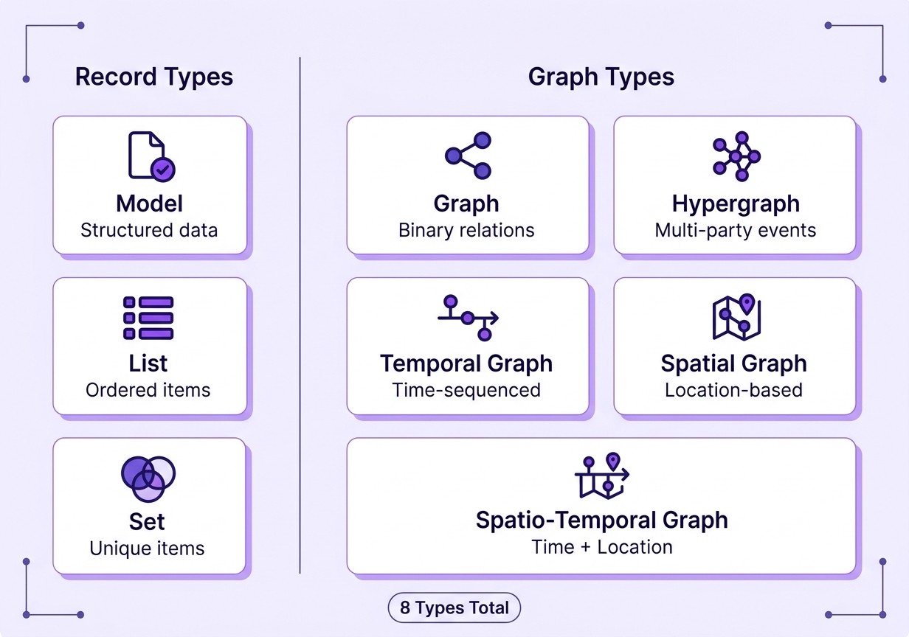

# 🔍 Hyper-Extract

> **"Stop reading. Start understanding."**

> *"告别文档焦虑，让信息一目了然"*

将文档转化为**知识摘要** —— 一行命令即可。

<p align="center">
  
  
  
</p>

[📖 English Version](./README.md) · [中文版](./README_ZH.md)

---

## 🚀 什么是 Hyper-Extract？

Hyper-Extract 是一个智能的、由大语言模型（LLM）驱动的知识提取与演进框架。它极大地简化了将杂乱不堪的文本转化为持久化、强类型的知识摘要的过程。无论从基础的**集合（Collection/List）**和**结构化模型（Model）**，还是到高阶复杂的**知识图谱（Knowledge Graph）**、**超图（Hypergraph）**，甚至是**时空图谱（Spatio-Temporal Graph）**，它都能轻松拿捏。


*从混沌杂乱的文档到清晰条理结构化知识节点的无缝管线。*

---

## ✨ 核心亮点

- 🔷 **8大自动数据结构（Auto-Types）：** 从基础的 `AutoModel`/`AutoList` 到高阶的 `AutoGraph`, `AutoHypergraph`, 以及 `AutoSpatioTemporalGraph`（时空图）。
- 🧠 **10+ 前沿提取引擎：** 开箱即用整合了业界顶尖的检索范式，例如 `graph_rag`, `light_rag`, 和 `cog_rag`。
- 📝 **声明式 YAML 模板：** 零代码定义提取策略。内置覆盖 6 大领域的 80+ 预设模板。
- 🔄 **知识增量演进：** 支持动态喂入新文档（Feed），让提取的知识图谱自动补全和扩展。

---

## ⚡ 快速上手

### 1. 极速安装

```bash
uv pip install hyper-extract
```

### 2. CLI 命令行玩法

仅仅几行命令即可完整体验提取、搜索和管理知识库：
*(注：默认使用 `gpt-4o-mini` 作为基础大模型，`text-embedding-3-small` 作为向量模型，兼顾高性价比与速度)*

```bash
he config init -k YOUR_API_KEY
he parse document.md -o ./output/ -l zh
he search ./output/ "有哪些关键事件？"
he feed ./output/ new_document.md
```

### 3. Python API 深度集成

```python
from hyperextract import Template

# 加载内置的 YAML 模板
ka = Template.create("finance/event_timeline")

# 一键解析文档
result = ka.parse(annual_report_text)
# result.timeline 将优雅地输出提取后的 Event 对象列表！
```

> 🔗 想了解完整的命令流，请查阅 [CLI 指南](./hyperextract/cli/README.md)

---

## 🧩 深入探究：8 种核心知识结构

不需要写繁琐的清洗代码，你的架构需求框架都能支持。



| 自动类型 (Auto-Type) | 最佳应用场景 | 典型案例 |
|-----------|----------|--------------------|
| **Model** | 结构化报告提取 | 财务报表摘要 |
| **List** | 顺序化列表 | 会议待办事项 |
| **Set** | 去重的集合 | 产品目录梳理 |
| **Graph** | 二元关系网络 | 社交媒体网络实体 |
| **Hypergraph** | 多方复杂关系 | 合同纠纷事件提取 |
| **TemporalGraph** | 时间序列图谱 | 新闻历史时间线 |
| **SpatialGraph** | 空间地理位置 | 物理设备拓扑图 |
| **SpatioTemporalGraph**| 时空双维度图谱 | 包含时间地理的战役记录 |

---

## 🛠️ 系统架构揭秘

系统底座基于稳固的铁三角架构：**Auto-Types** (多类型知识结构定义)、**Templates** (声明式提取 Schema)、以及 **Methods** (基于 LLM 的灵活执行策略)。


- **设计指南**: [模板设计指南](./hyperextract/templates/DESIGN_GUIDE.md)
- **内置模板**: [预设模板目录](./hyperextract/templates/presets/)

---

## 📈 与其他流行库的对比

| 特性 | GraphRAG | LightRAG | KG-Gen | ATOM | **Hyper-Extract** |
|------|:---:|:---:|:---:|:---:|:---:|
| 知识图谱支持 | ✅ | ✅ | ✅ | ✅ | ✅ |
| 时序图谱 | ✅ | ❌ | ❌ | ✅ | ✅ |
| 空间图谱 | ❌ | ❌ | ❌ | ❌ | ✅ |
| 超图提取 | ❌ | ❌ | ❌ | ❌ | ✅ |
| 领域模板驱动 | ❌ | ❌ | ❌ | ❌ | ✅ |
| 交互式 CLI | ❌ | ❌ | ❌ | ❌ | ✅ |
| 多语言完美支持 | 部分支持 | ❌ | ❌ | ❌ | ✅ |
| 命令行可视化 | 部分支持 | ❌ | ❌ | ❌ | ✅ |

---

## 📚 项目参考文档

| 文档名称 | 功能说明 |
|------|------|
| [CLI 命令行指南](./hyperextract/cli/README.md) | 所有 he 命令的完整参考 |
| [模板画廊](./hyperextract/templates/) | 38+ 内置垂直领域模板大全 |
| [示例代码示例](./examples/) | Python API 对接的 demo 实例 |
| [完整架构文档](./docs/) | 项目完整原理与架构解读 |

---

## 🤝 欢迎贡献参与

热情欢迎社区成员提交 Issues 和 PRs。让项目变得更好！

## 📄 开源协议

Apache-2.0
