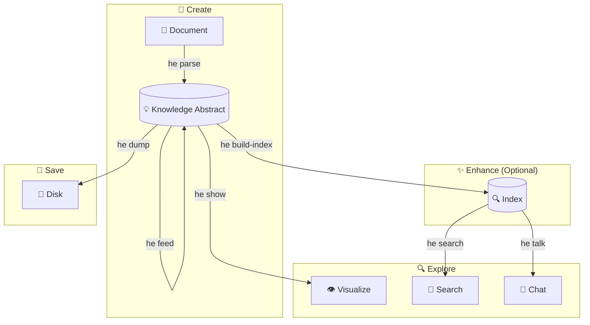

# CLI Guide

The Hyper-Extract CLI (`he`) provides a powerful, easy-to-use interface for knowledge extraction directly from your terminal.

---

## Installation

=== "uv (recommended)"

    ```bash
    uv pip install hyper-extract
    ```

=== "pip"

    ```bash
    pip install hyper-extract
    ```

Verify installation:

```bash
he --version
```

---

## Quick Command Reference

| Command | Purpose | Common Flags |
|---------|---------|--------------|
| `he parse` | Extract knowledge from documents | `-t` template, `-o` output, `-l` language |
| `he show` | Visualize knowledge graph | — |
| `he search` | Semantic search in knowledge abstract | `-n` top-k results |
| `he talk` | Chat with knowledge abstract | `-i` interactive, `-q` query |
| `he feed` | Add documents incrementally | — |
| `he info` | Show knowledge abstract statistics | — |
| `he build-index` | Build/rebuild search index | `-f` force rebuild |
| `he list` | List templates and methods | `template` or `method` |
| `he config` | Manage configuration | `init`, `show`, `set` |

---

## Complete Workflow

The typical workflow for extracting and interacting with knowledge:



1. **Create** — Extract knowledge from documents (`he parse`)
2. **Enhance** — Add documents incrementally (`he feed`), build index (`he build-index`)
3. **Explore** — Visualize (`he show`), search (`he search`), chat (`he talk`)
4. **Save** — Persist to disk (`he dump`)

→ [Detailed Workflow Walkthrough](workflow.md)

---

## Getting Started

### 1. Configure API Key

```bash
he config init -k YOUR_OPENAI_API_KEY
```

### 2. Extract Knowledge

```bash
he parse document.md -t general/biography_graph -o ./output/ -l en
```

### 3. Visualize

```bash
he show ./output/
```

---

## Commands in Detail

### Knowledge Extraction

- **[`he parse`](commands/parse.md)** — Extract knowledge from documents
- **[`he feed`](commands/feed.md)** — Add documents to existing knowledge abstract

### Exploration

- **[`he show`](commands/show.md)** — Visualize knowledge graph
- **[`he search`](commands/search.md)** — Semantic search
- **[`he talk`](commands/talk.md)** — Chat with knowledge abstract
- **[`he info`](commands/info.md)** — View knowledge abstract statistics

### Management

- **[`he build-index`](commands/build-index.md)** — Build search index
- **[`he list`](commands/list.md)** — List available templates/methods
- **[`he config`](commands/config.md)** — Configuration management

---

## Configuration

The CLI stores configuration in `~/.he/config.toml`.

→ [Configuration Reference](configuration.md)

---

## Template vs Method

Hyper-Extract offers two ways to extract knowledge:

### Templates (Recommended for Most Users)

Domain-specific, ready-to-use configurations:

```bash
he parse doc.md -t general/biography_graph -l en
```

### Methods (Advanced)

Underlying extraction algorithms:

```bash
he parse doc.md -m light_rag
```

→ [Learn when to use each](../concepts/architecture.md)

---

## Language Support

Templates support multiple languages:

```bash
# English
he parse doc.md -t general/biography_graph -l en

# Chinese
he parse doc.md -t general/biography_graph -l zh
```

Method templates always use English prompts.

---

## Examples by Use Case

### Research

```bash
# Extract from a research paper
he parse paper.md -t general/concept_graph -o ./paper_kb/ -l en

# Ask questions about it
he talk ./paper_kb/ -q "What are the main contributions?"
```

### Biography Analysis

```bash
# Extract from a biography
he parse biography.md -t general/biography_graph -o ./bio_kb/ -l en

# Visualize life events
he show ./bio_kb/
```

### Legal Document Analysis

```bash
# Extract contract obligations
he parse contract.md -t legal/contract_obligation -o ./contract_kb/ -l en

# Search for specific clauses
he search ./contract_kb/ "termination conditions"
```

---

## Tips and Best Practices

1. **Use templates for domain-specific tasks** — They're optimized for specific use cases
2. **Build the index** — Required for search and chat functionality
3. **Feed incrementally** — Add documents over time without reprocessing
4. **Choose the right language** — Improves extraction quality for non-English documents

---

## Getting Help

- View help for any command: `he <command> --help`
- List all templates: `he list template`
- List all methods: `he list method`
- [FAQ](../resources/faq.md)
- [Troubleshooting](../resources/troubleshooting.md)
