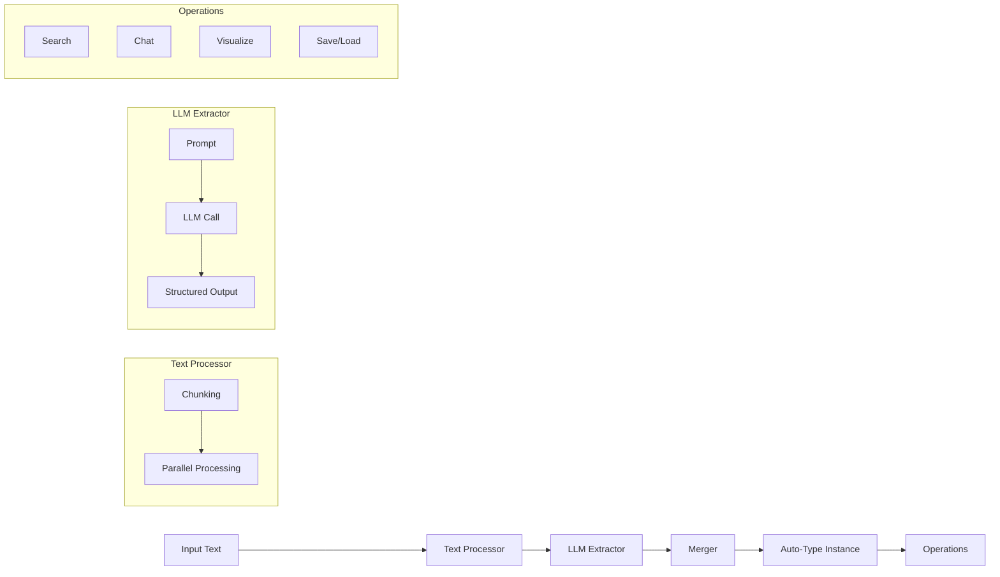

# Architecture

Deep dive into Hyper-Extract's system design and data flow.

---

## System Overview



---

## Data Flow

### 1. Input Processing

```python
# Input: Raw text
text = "Nikola Tesla was an inventor..."

# If text > chunk_size, split into chunks
chunks = [
    "Nikola Tesla was an inventor...",
    "He developed the AC system...",
    # ...
]
```

**Chunking Strategy:**
- Default size: 2048 characters
- Overlap: 256 characters
- Separators: Paragraphs, sentences, words

### 2. Extraction

```python
# Each chunk processed in parallel
for chunk in chunks:
    # LLM extracts structured data
    data = llm.extract(chunk, schema=AutoTypeSchema)
```

**Process:**
1. Format prompt with chunk
2. Call LLM with structured output
3. Parse response into Pydantic model

### 3. Merging

```python
# Merge results from all chunks
final_data = merge(chunk_results)
```

**Merge Operations:**
- Deduplicate entities
- Combine relations
- Resolve conflicts

### 4. Result

```python
# Auto-Type instance with extracted data
result = AutoTypeInstance(data=final_data)
```

---

## Component Details

### Template Engine

```
Template YAML → Parser → Configuration → Factory → Auto-Type Instance
```

Components:
- **Gallery** — Template discovery and listing
- **Parser** — YAML parsing and validation
- **Factory** — Instance creation

### Auto-Type Base Class

```python
class BaseAutoType:
    # Core functionality
    def parse(text) -> AutoType
    def feed_text(text) -> AutoType
    
    # Query
    def build_index()
    def search(query) -> List[Item]
    def chat(query) -> Response
    
    # Persistence
    def dump(path)
    def load(path)
    
    # Visualization
    def show()
```

### Method Registry

```python
# Methods are registered at import
_METHOD_REGISTRY = {
    "light_rag": {
        "class": Light_RAG,
        "type": "graph",
        "description": "..."
    },
    # ...
}
```

---

## Extension Points

### Custom Templates

Create domain-specific templates:

```yaml
# my_template.yaml
name: custom_extraction
type: graph
output:
  entities:
    fields:
      - name: name
        type: str
# ...
```

### Custom Auto-Types

Extend base classes:

```python
from hyperextract.types import AutoGraph

class MyCustomGraph(AutoGraph):
    def _default_prompt(self):
        return "Custom prompt..."
```

### Custom Methods

Implement extraction algorithms:

```python
from hyperextract.methods import register_method

class MyMethod:
    def extract(self, text):
        # Custom extraction logic
        pass

register_method("my_method", MyMethod, "graph", "Description")
```

---

## Performance Considerations

### Chunking

| Document Size | Chunks | Processing Time |
|---------------|--------|-----------------|
| < 2KB | 1 | Fast |
| 2-10KB | 2-5 | Medium |
| 10-50KB | 5-25 | Slow |
| > 50KB | 25+ | Very Slow |

### Parallelization

```python
# Default: 10 concurrent workers
# Adjustable via config
max_workers = 10
```

### Memory Usage

```python
# Index memory estimate
# ~1KB per entity/relation
```

---

## Design Principles

1. **Type Safety** — Pydantic schemas throughout
2. **Extensibility** — Plugin architecture for methods
3. **Usability** — Templates for common tasks
4. **Performance** — Chunking and parallelization
5. **Interoperability** — Standard formats (JSON, YAML)

---

## See Also

- [Auto-Types](autotypes.md)
- [Methods](methods.md)
- [Template Format](templates-format.md)
