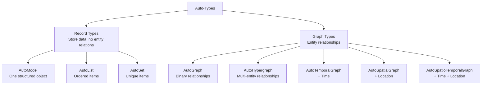

# Auto-Types

Understanding the 8 knowledge structure types: what they are and when to use them.

---

## What Are Auto-Types?

Auto-Types are intelligent data structures that define how extracted knowledge is organized. Think of them as "containers" that shape what comes out of your documents.

Key characteristics:

| Characteristic | Description |
|----------------|-------------|
| **Type-Safe** | Pydantic-based validation ensures consistent data |
| **Self-Contained** | Built-in operations (search, visualize, save) |
| **Serializable** | Save to disk, load later |
| **Composable** | Merge, update, extend incrementally |

---

## The 8 Auto-Types

Organized into two categories:



---

## Record Types

For **recording and storing data** without relationships between entities.

Record types extract **independent data items**, where each item does not contain information about its relationship to other items.

### AutoModel

**Purpose**: Extract a single structured object

**Think of it as**: A form with fields you want to fill in

**Example use cases**:

- Company earnings report (revenue, profit, growth)
- Product specification (name, price, features)
- Person profile (name, birth date, occupation)

**Example output structure**:

```json
{
    "company_name": "Tesla Inc",
    "revenue": 81.46,
    "employees": 127855
}
```

**Common templates**: `finance/earnings_summary`, `general/model`

---

### AutoList

**Purpose**: Extract an ordered collection

**Think of it as**: A ranked list or sequence

**Example use cases**:

- Top 10 movies of all time
- Step-by-step procedures
- Timeline events (simple chronological list)

**Example output structure**:

```json
{
    "items": [
        {"name": "Tesla Coil", "year": 1891},
        {"name": "Radio", "year": 1898}
    ]
}
```

**Key property**: Order matters - items are in sequence

**Common templates**: `general/list`, `legal/compliance_list`

---

### AutoSet

**Purpose**: Extract unique items (no duplicates)

**Think of it as**: A bag of unique tags

**Example use cases**:

- Keywords from a document
- Categories or tags
- Skill sets

**Example output structure**:

```json
{
    "items": ["Electrical Engineering", "Physics", "Invention"]
}
```

**Key property**: Duplicates are automatically removed

**Common templates**: `general/set`, `finance/risk_factor_set`

---

## Graph Types

For representing **relationships between entities**. Graph types include both the entities themselves (nodes) and the connections between them (edges).

Graph types are divided into subtypes based on relationship complexity and additional dimensional information:

### Basic Graphs

#### AutoGraph

**Purpose**: Extract binary relationships (two entities at a time)

**Think of it as**: A social network diagram

**Example use cases**:

- People and their connections (worked with, married to)
- Concepts and their relationships (is-a, part-of)
- Organizations and interactions

**Example output structure**:

```json
{
    "nodes": [
        {"name": "Tesla", "type": "person"},
        {"name": "AC Motor", "type": "invention"}
    ],
    "edges": [
        {"source": "Tesla", "target": "AC Motor", "type": "invented"}
    ]
}
```

**Key property**: Every relationship connects exactly two entities

**Common templates**: `general/graph`, `general/biography_graph`

---

#### AutoHypergraph

**Purpose**: Extract relationships involving 3+ entities

**Think of it as**: A project team where multiple people collaborate

**Example use cases**:

- Multi-party collaborations
- Complex interactions (buyer, seller, broker)
- Group memberships

**Example output structure**:

```json
{
    "nodes": [...],
    "edges": [
        {
            "entities": ["Tesla", "Westinghouse", "Niagara"],
            "type": "collaboration"
        }
    ]
}
```

**Key property**: One "edge" can connect multiple entities

**Common template**: `general/base_hypergraph`

---

### Enhanced Graphs (with dimensional information)

Built on basic graphs with added **time** or **space** dimensions for richer relationship descriptions.

#### AutoTemporalGraph (Temporal Graph)

**Purpose**: Extract relationships with time information

**Think of it as**: A timeline with connections

**Example use cases**:

- Biographies (life events with dates)
- Project histories
- Historical analysis

**Example output structure**:

```json
{
    "edges": [
        {
            "source": "Tesla",
            "target": "AC Motor",
            "type": "invented",
            "time": "1888"
        }
    ]
}
```

**Key property**: Every relationship has a time component

**Common templates**: `general/base_temporal_graph`, `finance/event_timeline`

---

#### AutoSpatialGraph (Spatial Graph)

**Purpose**: Extract relationships with location information

**Think of it as**: A map with connections

**Example use cases**:

- Travel logs
- Geographic networks
- Location-based asset tracking

**Example output structure**:

```json
{
    "entities": [
        {"name": "Colorado Springs", "location": "38.83,-104.82"}
    ],
    "relations": [
        {
            "source": "Tesla",
            "target": "Colorado Springs",
            "type": "conducted_experiments"
        }
    ]
}
```

**Key property**: Entities or relationships have geographic coordinates

**Common template**: `general/base_spatial_graph`

---

#### AutoSpatioTemporalGraph (Spatio-Temporal Graph)

**Purpose**: Extract relationships with both time and location

**Think of it as**: A historical map with dated events

**Example use cases**:

- Military history (battles with when and where)
- Epidemic tracking
- Historical migrations

**Example output structure**:

```json
{
    "relations": [
        {
            "source": "Tesla",
            "target": "AC Motor",
            "type": "demonstrated",
            "time": "1888",
            "location": "Pittsburgh"
        }
    ]
}
```

**Key property**: Complete context - who, what, when, and where

**Common template**: `general/base_spatio_temporal_graph`

---

## Selection Guide

### Decision Tree

```
What do you need to extract?
│
├─ Single structured object (like a form)
│  └─ AutoModel
│
├─ Collection of items
│  ├─ Order matters? → AutoList
│  └─ Just unique items? → AutoSet
│
└─ Relationships between entities → Graph Types
   ├─ Relationship arity
   │  ├─ Binary (2 entities) → Basic Graphs
   │  │  ├─ Need time info? → AutoTemporalGraph
   │  │  ├─ Need location info? → AutoSpatialGraph
   │  │  ├─ Need both? → AutoSpatioTemporalGraph
   │  │  └─ Neither? → AutoGraph
   │  │
   │  └─ Multi-entity (3+ entities) → AutoHypergraph
```

### By Use Case

| Use Case | Auto-Type | Why |
|----------|-----------|-----|
| Company financial report | AutoModel | Single structured summary |
| Top 10 list | AutoList | Ordered/ranked items |
| Keywords/tags | AutoSet | Unique collection |
| People network | AutoGraph | Binary relationships |
| Project teams | AutoHypergraph | Multi-person collaborations |
| Biography timeline | AutoTemporalGraph | Events with dates |
| Travel itinerary | AutoSpatialGraph | Places with connections |
| Historical events | AutoSpatioTemporalGraph | Full context needed |

### Quick Reference

#### Record Types

| Auto-Type | Output Shape | Key Feature |
|-----------|--------------|-------------|
| AutoModel | Single object | Fixed schema fields |
| AutoList | Array | Maintains order |
| AutoSet | Array | Deduplicates |

#### Graph Types

| Auto-Type | Output Shape | Key Feature |
|-----------|--------------|-------------|
| AutoGraph | Nodes + Edges | Binary relations (2 entities) |
| AutoHypergraph | Nodes + Hyperedges | Multi-entity relations (3+ entities) |
| AutoTemporalGraph | Nodes + Time-Edges | Binary relations + time dimension |
| AutoSpatialGraph | Nodes + Geo-Edges | Binary relations + geographic dimension |
| AutoSpatioTemporalGraph | Nodes + Spatio-Temporal-Edges | Binary relations + time + space |

---

## Next Steps

Ready to use Auto-Types? Choose your path:

**Quick Start**: Use built-in [Templates](../templates/index.md) — no Auto-Type knowledge needed

**More Control**: Learn how to work with Auto-Types in Python:
- [Working with Auto-Types](../python/guides/working-with-autotypes.md) — practical examples
- [Python SDK Quickstart](../python/quickstart.md) — get started in 5 minutes

**Advanced**: Create custom Auto-Type configurations
- [Creating Custom Templates](../python/guides/custom-templates.md)
- [API Reference](../python/api-reference/autotypes/base.md)
