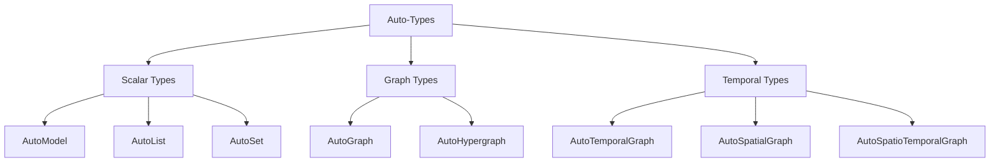

# Auto-Types

Complete guide to the 8 knowledge structure types.

---

## Overview

Auto-Types are intelligent data structures that:
- Define extraction output format
- Provide type-safe schemas
- Include built-in operations (search, visualize, etc.)
- Support serialization

---

## The 8 Auto-Types



---

## Scalar Types

### AutoModel

**Purpose**: Single structured object

**Use When**:
- Extracting a summary/report
- Structured data with known fields
- Single entity with many attributes

**Example Output**:
```python
{
    "company_name": "Tesla Inc",
    "revenue": 81.46,
    "eps": 4.07,
    "employees": 127855
}
```

**Common Templates**:
- `finance/earnings_summary`
- `general/base_model`

---

### AutoList

**Purpose**: Ordered collection

**Use When**:
- Sequence matters
- Ranked items
- Timeline events (simple)

**Example Output**:
```python
{
    "items": [
        {"name": "AC Motor", "year": 1888},
        {"name": "Tesla Coil", "year": 1891},
        {"name": "Radio", "year": 1898}
    ]
}
```

**Common Templates**:
- `general/base_list`
- `legal/compliance_list`

---

### AutoSet

**Purpose**: Deduplicated collection

**Use When**:
- Unique items only
- Tags/categories
- Membership testing

**Example Output**:
```python
{
    "items": [
        "Electrical Engineering",
        "Physics",
        "Invention",
        "Renewable Energy"
    ]
}
```

**Common Templates**:
- `general/base_set`
- `finance/risk_factor_set`

---

## Graph Types

### AutoGraph

**Purpose**: Entity-relationship network

**Use When**:
- People, organizations, concepts
- Binary relationships
- Knowledge graphs

**Example Output**:
```python
{
    "entities": [
        {"name": "Tesla", "type": "person"},
        {"name": "Edison", "type": "person"},
        {"name": "AC Motor", "type": "invention"}
    ],
    "relations": [
        {"source": "Tesla", "target": "AC Motor", "type": "invented"},
        {"source": "Tesla", "target": "Edison", "type": "rivals"}
    ]
}
```

**Common Templates**:
- `general/knowledge_graph`
- `general/biography_graph`

---

### AutoHypergraph

**Purpose**: Multi-entity relationships

**Use When**:
- Relationships involve 3+ entities
- Complex interactions
- N-ary associations

**Example Output**:
```python
{
    "entities": [...],
    "hyperedges": [
        {
            "entities": ["Tesla", "Westinghouse", "Niagara"],
            "type": "collaboration",
            "description": "Power plant project"
        }
    ]
}
```

**Common Templates**:
- `general/base_hypergraph`

---

## Temporal Types

### AutoTemporalGraph

**Purpose**: Graph + time information

**Use When**:
- Timeline is important
- Event sequences
- Historical analysis

**Example Output**:
```python
{
    "entities": [...],
    "relations": [
        {
            "source": "Tesla",
            "target": "AC Motor",
            "type": "invented",
            "time": "1888"
        },
        {
            "source": "Tesla",
            "target": "Wardenclyffe Tower",
            "type": "built",
            "time": "1901-1902"
        }
    ]
}
```

**Common Templates**:
- `general/base_temporal_graph`
- `finance/event_timeline`

---

### AutoSpatialGraph

**Purpose**: Graph + location information

**Use When**:
- Geographic data
- Location-based analysis
- Mapping

**Example Output**:
```python
{
    "entities": [
        {
            "name": "Colorado Springs",
            "type": "location",
            "coordinates": "38.8339,-104.8214"
        }
    ],
    "relations": [
        {
            "source": "Tesla",
            "target": "Colorado Springs",
            "type": "conducted_experiments",
            "location": "Colorado Springs"
        }
    ]
}
```

**Common Templates**:
- `general/base_spatial_graph`

---

### AutoSpatioTemporalGraph

**Purpose**: Graph + time + space

**Use When**:
- Full context needed
- Historical geography
- Event analysis with when and where

**Example Output**:
```python
{
    "entities": [...],
    "relations": [
        {
            "source": "Tesla",
            "target": "AC Motor",
            "type": "demonstrated",
            "time": "1888",
            "location": "Pittsburgh",
            "description": "Demonstration at Westinghouse"
        }
    ]
}
```

**Common Templates**:
- `general/base_spatio_temporal_graph`

---

## Selection Guide

### Decision Tree

```
What do you need to extract?
│
├─ Single structured object → AutoModel
│
├─ Collection of items
│   ├─ Ordered/Ranked → AutoList
│   └─ Unique/Tags → AutoSet
│
└─ Relationships
    ├─ Simple (binary)
    │   ├─ With time → AutoTemporalGraph
    │   ├─ With space → AutoSpatialGraph
    │   ├─ With both → AutoSpatioTemporalGraph
    │   └─ Neither → AutoGraph
    │
    └─ Complex (multi-entity)
        └─ AutoHypergraph
```

### By Use Case

| Use Case | Recommended Type |
|----------|------------------|
| Company report | AutoModel |
| Top 10 list | AutoList |
| Tags/keywords | AutoSet |
| People network | AutoGraph |
| Project teams | AutoHypergraph |
| Biography timeline | AutoTemporalGraph |
| Travel log | AutoSpatialGraph |
| Historical events | AutoSpatioTemporalGraph |

---

## Common Operations

All Auto-Types support:

```python
# Extraction
result = ka.parse(text)

# Incremental update
result.feed_text(more_text)

# Search (requires index)
result.build_index()
results = result.search("query")

# Chat (requires index)
response = result.chat("question")

# Visualization
result.show()

# Persistence
result.dump("./path/")
result.load("./path/")

# Check empty
if result.empty():
    print("No data")

# Clear
result.clear()
result.clear_index()
```

---

## See Also

- [Working with Auto-Types](../python/guides/working-with-autotypes.md)
- [Template Library](../templates/index.md)
- [Methods](methods.md)
