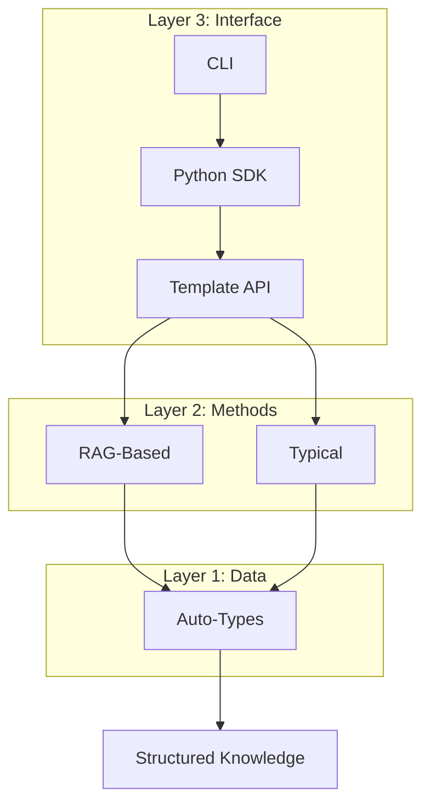

# Concepts

Understand the fundamental concepts behind Hyper-Extract.

---

## Three-Layer Architecture

Hyper-Extract is built on a three-layer architecture:

| Layer | Purpose | Components |
|-------|---------|------------|
| **Auto-Types** | Define data structures | 8 type classes |
| **Methods** | Extraction algorithms | RAG + Typical methods |
| **Templates** | Domain-specific configs | 80+ preset templates |

---

## Core Concepts

### [Auto-Types](autotypes.md)

The 8 data structure types that define extraction output:

- **Scalar Types**: AutoModel, AutoList, AutoSet
- **Graph Types**: AutoGraph, AutoHypergraph
- **Temporal Types**: AutoTemporalGraph, AutoSpatialGraph, AutoSpatioTemporalGraph

→ [Learn about Auto-Types](autotypes.md)

### [Methods](methods.md)

The extraction algorithms:

- **RAG-Based**: GraphRAG, LightRAG, Hyper-RAG
- **Typical**: iText2KG, KG-Gen, Atom

→ [Learn about Methods](methods.md)

### [Template Format](templates-format.md)

The YAML format for defining extraction templates:

- Schema definition
- Prompt engineering
- Guidelines and rules

→ [Learn about Template Format](templates-format.md)

### [Architecture](architecture.md)

Deep dive into the system design:

- Data flow
- Processing pipeline
- Extension points

→ [Learn about Architecture](architecture.md)

---

## Quick Links

- [CLI Documentation](../cli/index.md) — Terminal usage
- [Python SDK](../python/index.md) — Programmatic usage
- [Template Library](../templates/index.md) — Available templates
