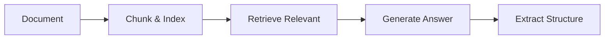

# Methods

Guide to extraction algorithms and when to use each.

---

## Overview

Methods are the underlying algorithms that extract knowledge from text. They determine:
- How text is processed
- How entities and relations are identified
- The quality and style of extraction

---

## Method Categories

### RAG-Based Methods

**Retrieval-Augmented Generation** combines information retrieval with text generation.

**Best for**: Large documents, complex queries



### Typical Methods

**Direct extraction** without retrieval.

**Best for**: Smaller documents, direct extraction


---

## RAG-Based Methods

### light_rag

**Description**: Lightweight Graph-based RAG

**Characteristics**:
- Fastest RAG method
- Binary edges (source → target)
- Good balance of speed/quality
- Suitable for most use cases

**Best for**:
- General-purpose extraction
- Medium to large documents
- Quick results

**Usage**:
```python
ka = Template.create("method/light_rag")
```

---

### graph_rag

**Description**: Graph-RAG with Community Detection

**Characteristics**:
- Community detection for organization
- Hierarchical summaries
- Best for very large documents
- Slower but thorough

**Best for**:
- Very large documents (books, long papers)
- Complex topic structures
- Research papers

**Usage**:
```python
ka = Template.create("method/graph_rag")
```

---

### hyper_rag

**Description**: Hypergraph-based RAG

**Characteristics**:
- N-ary hyperedges (2+ entities)
- Captures complex relationships
- Richer graph structure

**Best for**:
- Multi-party relationships
- Project collaborations
- Complex organizational structures

**Usage**:
```python
ka = Template.create("method/hyper_rag")
```

---

### hypergraph_rag

**Description**: Advanced Hypergraph RAG

**Characteristics**:
- Enhanced hypergraph capabilities
- Advanced relationship modeling

**Best for**:
- Complex hypergraph scenarios
- Advanced relationship analysis

**Usage**:
```python
ka = Template.create("method/hypergraph_rag")
```

---

### cog_rag

**Description**: Cognitive RAG

**Characteristics**:
- Cognitive retrieval mechanisms
- Reasoning-focused

**Best for**:
- Reasoning tasks
- Question-answering systems

**Usage**:
```python
ka = Template.create("method/cog_rag")
```

---

## Typical Methods

### itext2kg

**Description**: High-quality triple-based extraction

**Characteristics**:
- Optimized for triple quality
- Iterative refinement
- Good for knowledge base construction

**Best for**:
- Knowledge graph construction
- High-quality requirements
- Triple extraction

**Usage**:
```python
ka = Template.create("method/itext2kg")
```

---

### itext2kg_star

**Description**: Enhanced iText2KG

**Characteristics**:
- Improved extraction quality
- Better handling of complex cases
- Enhanced entity linking

**Best for**:
- When quality is critical
- Complex extraction scenarios
- Production systems

**Usage**:
```python
ka = Template.create("method/itext2kg_star")
```

---

### kg_gen

**Description**: Knowledge Graph Generator

**Characteristics**:
- Configurable generation
- Flexible schema
- Fast processing

**Best for**:
- Custom schemas
- Rapid prototyping
- Flexible requirements

**Usage**:
```python
ka = Template.create("method/kg_gen")
```

---

### atom

**Description**: Temporal knowledge graph with evidence

**Characteristics**:
- Temporal fact extraction
- Evidence attribution
- Confidence scoring

**Best for**:
- Temporal analysis
- Fact verification
- Timeline extraction

**Usage**:
```python
ka = Template.create("method/atom")
```

---

## Selection Guide

### By Document Size

| Size | Recommended |
|------|-------------|
| Small (< 1K words) | itext2kg, kg_gen |
| Medium (1-10K) | light_rag, itext2kg_star |
| Large (10-50K) | light_rag, graph_rag |
| Very Large (> 50K) | graph_rag |

### By Use Case

| Use Case | Recommended |
|----------|-------------|
| Quick extraction | light_rag |
| Best quality | itext2kg_star |
| Large documents | graph_rag |
| Complex relationships | hyper_rag |
| Temporal facts | atom |
| Knowledge bases | itext2kg |

### By Priority

| Priority | Recommended |
|----------|-------------|
| Speed | light_rag |
| Quality | itext2kg_star |
| Cost | light_rag |
| Completeness | graph_rag |

---

## Comparison Table

| Method | Speed | Quality | Memory | Best For |
|--------|-------|---------|--------|----------|
| light_rag | ⭐⭐⭐ | ⭐⭐ | ⭐⭐ | General use |
| graph_rag | ⭐ | ⭐⭐⭐ | ⭐⭐⭐ | Large docs |
| hyper_rag | ⭐⭐ | ⭐⭐⭐ | ⭐⭐⭐ | Complex relations |
| itext2kg | ⭐⭐⭐ | ⭐⭐⭐ | ⭐ | Quality focused |
| atom | ⭐⭐ | ⭐⭐⭐ | ⭐⭐ | Temporal data |
| kg_gen | ⭐⭐⭐ | ⭐⭐ | ⭐ | Flexibility |

---

## Listing Available Methods

```python
from hyperextract.methods import list_methods

methods = list_methods()
for name, info in methods.items():
    print(f"{name}: {info['description']}")
    print(f"  Type: {info['type']}")
```

---

## See Also

- [Choosing Methods Guide](../python/guides/choosing-methods.md)
- [Templates](../templates/index.md)
- [Auto-Types](autotypes.md)
