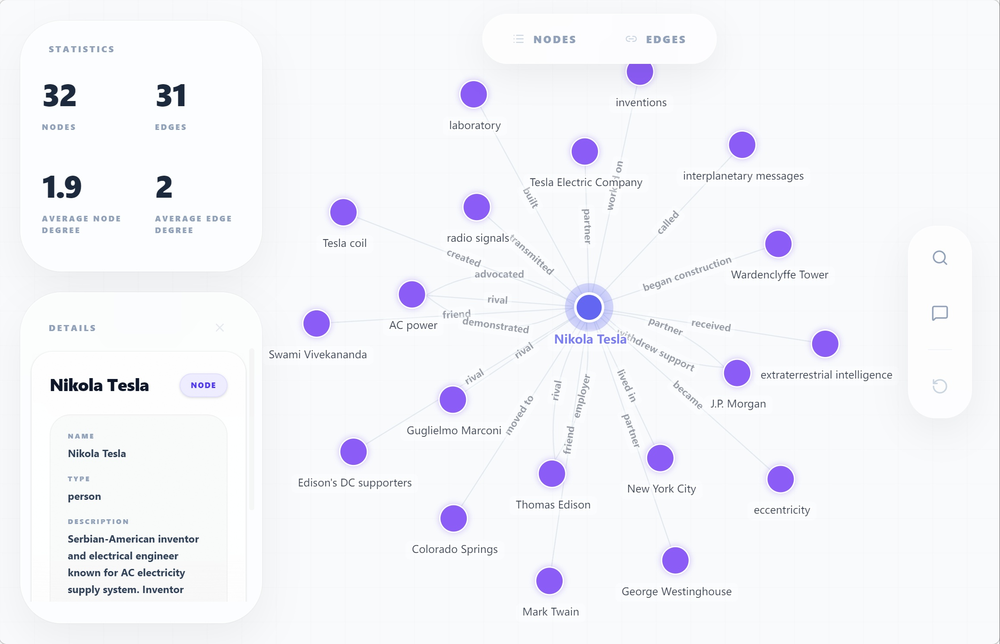

# CLI Quickstart

Get your first knowledge extraction running in 5 minutes using the terminal.

---

## Prerequisites

- [Hyper-Extract installed](installation.md)
- A text file to extract from (we'll use an example)

---

## Step 1: Configure API Key

Run the following command to configure your API key:

```bash
he config init -k YOUR_OPENAI_API_KEY
```

This creates a configuration file at `~/.he/config.toml`. You only need to do this once.

---

## Step 2: Download Sample Document

```bash
# Download a sample biography
curl -o tesla.md https://raw.githubusercontent.com/yifanfeng97/hyper-extract/main/examples/en/tesla.md
```

Or create a simple test file:

```bash
cat > sample.txt << 'EOF'
Nikola Tesla was a Serbian-American inventor, electrical engineer, 
mechanical engineer, and futurist. He is best known for his 
contributions to the design of the modern alternating current 
(AC) electricity supply system.

Born: July 10, 1856, Smiljan, Croatia
Died: January 7, 1943, New York City, NY

Tesla immigrated to the United States in 1884 and briefly worked 
with Thomas Edison before the two parted ways due to conflicting 
business and scientific interests. He later established his own 
laboratory and developed numerous revolutionary inventions, 
including the Tesla coil, induction motor, and wireless transmission 
technologies.

Despite his brilliance, Tesla struggled financially in his later years
and died impoverished in a New York hotel room. His legacy was 
largely overlooked during his lifetime but has since been recognized 
worldwide, with the Tesla unit of magnetic flux density named in his honor.
EOF
```

---

## Step 3: Extract Knowledge

Run the `parse` command to extract knowledge:

```bash
he parse tesla.md -t general/biography_graph -o ./output/ -l en
```

What this does:
- `-t general/biography_graph` — Use the biography graph template
- `-o ./output/` — Save results to the output directory
- `-l en` — Process in English

**Output:**
```
Input: tesla.md
Output: ./output/
Template: general/biography_graph
Language: en
Build Index: Yes

Template resolved: Biography Graph Template
✓ Knowledge extracted to ./output/

What's next?
  he show ./output/                    # Visualize knowledge graph
  he feed ./output/ <new_document>     # Append more documents
  he search ./output/ "keyword"        # Semantic search
  he talk ./output/ -i                 # Interactive chat
```

---

## Step 4: Visualize the Knowledge Graph

```bash
he show ./output/
```

This opens an interactive visualization in your browser, showing:
- **Entities** (people, places, events) as nodes
- **Relationships** as edges connecting the nodes



---

## Step 5: Search Your Knowledge Abstract

```bash
he search ./output/ "What were Tesla's major inventions?"
```

**Output:**
```
Found 3 result(s):

Result 1:
{
  "name": "Nikola Tesla",
  "type": "person",
  "description": "Serbian-American inventor..."
}
...
```

---

## Step 6: Chat with Your Knowledge

Interactive mode:

```bash
he talk ./output/ -i
```

Or ask a single question:

```bash
he talk ./output/ -q "Summarize Tesla's career in three sentences"
```

---

## Step 7: Incrementally Add Knowledge

Got more documents? Add them without reprocessing:

```bash
he feed ./output/ additional_document.md
```

Then visualize the updated knowledge:

```bash
he show ./output/
```

---

## Complete Workflow

Here's the typical workflow:

```bash
# 1. Extract knowledge
he parse document.md -t general/biography_graph -o ./output/ -l en

# 2. Visualize
he show ./output/

# 3. Search
he search ./output/ "your query"

# 4. Chat
he talk ./output/ -i

# 5. Add more documents
he feed ./output/ another_document.md

# 6. Rebuild index if needed
he build-index ./output/
```

---

## What's Next?

- [CLI Workflow Guide](../cli/workflow.md) — Complete workflow walkthrough
- [All CLI Commands](../cli/index.md) — Detailed command reference
- [Template Library](../templates/index.md) — Find templates for your use case

---

## Troubleshooting

**"No API key found"**
→ Run `he config init -k YOUR_API_KEY`

**"Template not found"**
→ List available templates with `he list template`

**"Output directory already exists"**
→ Add `-f` flag to force overwrite, or choose a different output path
