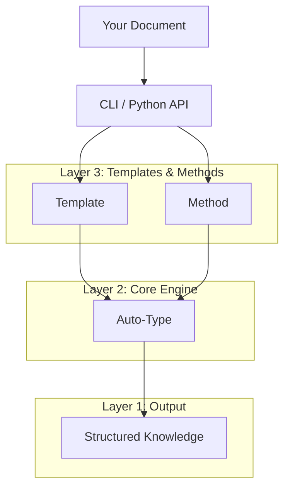

<div align="center">
  
</div>

<br/>

> **Transform documents into structured knowledge with one command.**
> 
> *"告别文档焦虑，让信息一目了然"*

**Hyper-Extract** is an intelligent, LLM-powered knowledge extraction framework. It transforms unstructured text into persistent, predictable, and strongly-typed knowledge structures—from simple lists to complex knowledge graphs, hypergraphs, and spatio-temporal graphs.

---

## ⚡ 5-Minute Quick Start

=== "CLI (Terminal)"

    ```bash
    # 1. Install CLI tool
    uv tool install hyperextract

    # 2. Configure API Key
    he config init -k YOUR_OPENAI_API_KEY

    # 3. Extract knowledge from a document
    he parse tesla.md -t general/biography_graph -o ./output/ -l en

    # 4. Visualize the knowledge graph
    he show ./output/
    ```

=== "Python"

    ```python
    from hyperextract import Template

    # 1. Create a template
    ka = Template.create("general/biography_graph", "en")

    # 2. Extract knowledge
    with open("tesla.md") as f:
        result = ka.parse(f.read())

    # 3. Visualize
    ka.show(result)
    ```

**→ Ready to dive deeper?** Check out the [Getting Started Guide](getting-started/index.md) or jump to [CLI](cli/index.md) / [Python SDK](python/index.md) documentation.

---

## ✨ What Makes Hyper-Extract Different?

<div class="grid cards" markdown>

-   :material-shape:{ .lg .middle } **8 Auto-Types**

    ---

    From simple `AutoList`/`AutoModel` to advanced `AutoGraph`, `AutoHypergraph`, and `AutoSpatioTemporalGraph`. Pick the right structure for your data.

-   :material-brain:{ .lg .middle } **10+ Extraction Engines**

    ---

    Built-in support for GraphRAG, LightRAG, Hyper-RAG, KG-Gen, iText2KG, and more. Choose the best method for your use case.

-   :material-file-document:{ .lg .middle } **80+ Domain Templates**

    ---

    Ready-to-use templates for Finance, Legal, Medical, TCM, and Industry. Zero configuration needed.

-   :material-sync:{ .lg .middle } **Incremental Evolution**

    ---

    Feed new documents to continuously expand your knowledge abstract. No need to reprocess everything.

</div>

---

## 🎯 Choose Your Path

<div class="grid cards" markdown>

-   :material-console:{ .lg .middle } __CLI User__

    ---

    Process documents directly from your terminal. Perfect for:
    
    - Quick knowledge extraction
    - Batch document processing
    - Building knowledge abstracts without coding
    
    [:octicons-arrow-right-24: CLI Guide](cli/index.md)

-   :material-language-python:{ .lg .middle } __Python Developer__

    ---

    Integrate into your Python applications. Perfect for:
    
    - Custom extraction pipelines
    - Integration with existing workflows
    - Building AI-powered applications
    
    [:octicons-arrow-right-24: Python SDK](python/index.md)

-   :material-school:{ .lg .middle } __Want to Learn More?__

    ---

    Understand the concepts and architecture:
    
    - How Auto-Types work
    - Choosing extraction methods
    - Creating custom templates
    
    [:octicons-arrow-right-24: Concepts](concepts/index.md)

</div>

---

## 🧩 The 8 Auto-Types at a Glance

| Type | Use Case | Example Output |
|------|----------|----------------|
| **AutoModel** | Structured summaries | A pydantic model with specific fields |
| **AutoList** | Collections of items | A list of entities or facts |
| **AutoSet** | Deduplicated collections | A set of unique items |
| **AutoGraph** | Entity-relationship networks | Knowledge graph with nodes and edges |
| **AutoHypergraph** | Multi-entity relationships | Hyperedges connecting multiple nodes |
| **AutoTemporalGraph** | Time-based relationships | Graph with temporal information |
| **AutoSpatialGraph** | Location-based relationships | Graph with geographic data |
| **AutoSpatioTemporalGraph** | Time + Space combined | Full context with when and where |

→ [Learn which Auto-Type to choose](concepts/autotypes.md)

---

## 🏗️ Architecture Overview

Hyper-Extract follows a **three-layer architecture**:



1. **Auto-Types** — Define the output data structure (8 types)
2. **Methods** — Provide extraction algorithms (RAG-based and Typical)
3. **Templates** — Offer domain-specific, ready-to-use configurations

You can use Hyper-Extract at any level: pick a template for quick results, choose a method for more control, or work directly with Auto-Types for full customization.

---

## 📊 Comparison with Other Tools

| Feature | GraphRAG | LightRAG | KG-Gen | **Hyper-Extract** |
|---------|:--------:|:--------:|:------:|:-----------------:|
| Knowledge Graph | ✅ | ✅ | ✅ | ✅ |
| Temporal Graph | ✅ | ❌ | ❌ | ✅ |
| Spatial Graph | ❌ | ❌ | ❌ | ✅ |
| Hypergraph | ❌ | ❌ | ❌ | ✅ |
| Domain Templates | ❌ | ❌ | ❌ | ✅ |
| CLI Tool | ✅ | ❌ | ❌ | ✅ |
| Multi-language | ✅ | ❌ | ❌ | ✅ |

---

## 📚 Documentation Structure

- **[Getting Started](getting-started/index.md)** — Installation and your first extraction
- **[CLI Guide](cli/index.md)** — Complete terminal workflow documentation
- **[Python SDK](python/index.md)** — API reference and developer guides
- **[Concepts](concepts/index.md)** — Understanding the architecture
- **[Templates](templates/index.md)** — Domain-specific extraction templates
- **[Resources](resources/index.md)** — FAQ, troubleshooting, and contributing

---

## 🤝 Contributing

Contributions are welcome! Whether it's bug reports, feature requests, or documentation improvements, please feel free to submit an issue or pull request.

[:fontawesome-brands-github: GitHub Repository](https://github.com/yifanfeng97/hyper-extract){ .md-button .md-button--primary }

---

## 📄 License

Hyper-Extract is licensed under the [Apache-2.0 License](https://github.com/yifanfeng97/hyper-extract/blob/main/LICENSE).
