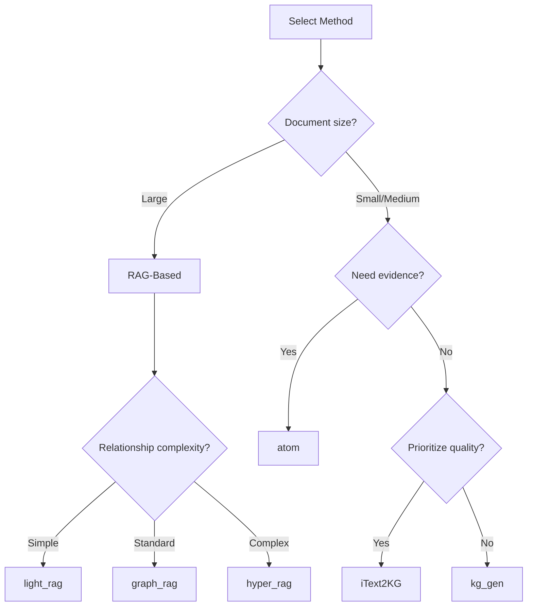

# Choosing Methods

Understand extraction methods and when to use each.

---

## What Are Methods?

Methods are the underlying algorithms that power knowledge extraction. While templates provide easy-to-use, domain-specific configurations, methods give you direct access to the extraction algorithms.

---

## Method Categories

### RAG-Based Methods

**Retrieval-Augmented Generation** methods excel at processing large documents by combining retrieval with generation.

| Method | Best For | Key Feature |
|--------|----------|-------------|
| `light_rag` | General use | Fast, lightweight |
| `graph_rag` | Large documents | Community detection |
| `hyper_rag` | Complex relationships | N-ary hyperedges |
| `hypergraph_rag` | Advanced scenarios | Enhanced hypergraph |
| `cog_rag` | Reasoning tasks | Cognitive retrieval |

### Typical Methods

**Direct extraction** methods that process text without retrieval.

| Method | Best For | Key Feature |
|--------|----------|-------------|
| `itext2kg` | Quality-focused | High-quality triples |
| `itext2kg_star` | Enhanced quality | Improved iText2KG |
| `kg_gen` | Flexibility | Configurable generation |
| `atom` | Temporal data | Evidence attribution |

---

## Using Methods

### Basic Usage

```python
from hyperextract import Template

# Create from method
ka = Template.create("method/light_rag")

# Extract
result = ka.parse(text)
```

### With Custom Clients

```python
from langchain_openai import ChatOpenAI, OpenAIEmbeddings
from hyperextract import Template

llm = ChatOpenAI(model="gpt-4o")
emb = OpenAIEmbeddings(model="text-embedding-3-large")

ka = Template.create(
    "method/graph_rag",
    llm_client=llm,
    embedder=emb
)
```

---

## Method Selection Guide

### Decision Tree



### By Use Case

#### Quick Extraction (Small Documents)

```python
# Fast and simple
ka = Template.create("method/kg_gen")
```

#### High-Quality Results

```python
# Best extraction quality
ka = Template.create("method/itext2kg_star")
```

#### Large Documents

```python
# Efficient processing
ka = Template.create("method/light_rag")
```

#### Complex Relationships

```python
# Multi-entity relationships
ka = Template.create("method/hyper_rag")
```

#### Temporal Analysis

```python
# Time-based with evidence
ka = Template.create("method/atom")
```

---

## RAG vs Typical Comparison

| Feature | RAG-Based | Typical |
|---------|-----------|---------|
| **Document size** | Large (10k+ words) | Small-Medium |
| **Speed** | Slower (retrieval step) | Faster |
| **Memory** | Higher | Lower |
| **Quality** | Good for large docs | Better for small docs |
| **Context handling** | Excellent | Good |
| **Use case** | Books, papers, reports | Articles, summaries |

---

## Method Details

### light_rag

Best for: General-purpose, fast extraction

```python
ka = Template.create("method/light_rag")

# Characteristics:
# - Fastest RAG method
# - Binary edges (source-target)
# - Good balance of speed/quality
```

### graph_rag

Best for: Large documents with community structure

```python
ka = Template.create("method/graph_rag")

# Characteristics:
# - Community detection
# - Hierarchical summaries
# - Best for very large documents
```

### hyper_rag

Best for: Complex multi-entity relationships

```python
ka = Template.create("method/hyper_rag")

# Characteristics:
# - Hyperedges (connect 2+ entities)
# - Captures complex relationships
# - Richer graph structure
```

### itext2kg

Best for: High-quality triple extraction

```python
ka = Template.create("method/itext2kg")

# Characteristics:
# - Optimized for triple quality
# - Iterative refinement
# - Good for knowledge base construction
```

### atom

Best for: Temporal analysis with evidence

```python
ka = Template.create("method/atom")

# Characteristics:
# - Temporal fact extraction
# - Evidence attribution
# - Confidence scoring
```

---

## Listing Methods

```python
from hyperextract import Template
from hyperextract.methods import list_methods

# List all methods
methods = list_methods()
for name, info in methods.items():
    print(f"{name}: {info['description']}")
    print(f"  Type: {info['type']}")
```

---

## Method Configuration

Methods can be configured through parameters:

```python
from hyperextract import Template

# Most methods use default configuration
# Advanced users can create method instances directly
from hyperextract.methods import Light_RAG
from langchain_openai import ChatOpenAI, OpenAIEmbeddings

llm = ChatOpenAI()
emb = OpenAIEmbeddings()

ka = Light_RAG(
    llm_client=llm,
    embedder=emb,
    # Method-specific parameters
    chunk_size=1024,
    max_workers=5
)
```

---

## Best Practices

1. **Start with light_rag** — Good default for most cases
2. **Use itext2kg for quality** — When extraction quality is critical
3. **Try hyper_rag for complex data** — When relationships are multi-faceted
4. **Consider atom for temporal data** — When time is important
5. **Benchmark on your data** — Methods perform differently on different content

---

## When to Use Templates vs Methods

| Scenario | Recommendation |
|----------|----------------|
| Quick start | Templates |
| Domain-specific task | Templates |
| Production system | Templates |
| Research/Experimentation | Methods |
| Custom requirements | Methods |
| Performance optimization | Methods |
| Full control | Methods |

---

## See Also

- [Using Templates](using-templates.md)
- [Template Library](../../templates/index.md)
- [Methods Concept Doc](../../concepts/methods.md)
