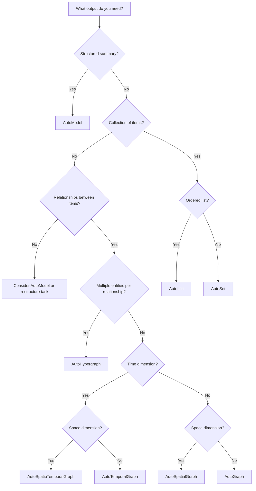

# Choose by Output Type

Select a template based on what kind of output you need.

---

## Decision Tree



---

## AutoModel — Structured Summary

**Use when:** You need a structured report or summary

**Output:** Single structured object with fields

**Examples:**
- Financial earnings summary
- Patient discharge summary
- Product catalog entry

**Templates:**

| Template | Domain |
|----------|--------|
| `general/model` | General purpose |
| `finance/earnings_summary` | Financial reports |
| `medicine/discharge_instruction` | Medical |
| `tcm/herb_property` | TCM |

**Example:**
```python
from hyperextract import Template

ka = Template.create("finance/earnings_summary", "en")
result = ka.parse(earnings_report)

print(result.data.revenue)      # 1000000
print(result.data.eps)          # 2.50
print(result.data.yoy_growth)   # 15.3
```

---

## AutoList — Ordered Collection

**Use when:** You need an ordered list of items

**Output:** Ordered list with possible duplicates

**Examples:**
- Compliance checklist (ordered by importance)
- Step-by-step procedures
- Ranked items

**Templates:**

| Template | Domain |
|----------|--------|
| `general/list` | General purpose |
| `legal/compliance_list` | Legal compliance |
| `legal/contract_obligation` | Contract obligations |
| `medicine/symptom_list` | Medical symptoms |

**Example:**
```python
ka = Template.create("legal/compliance_list", "en")
result = ka.parse(contract_text)

for item in result.data.items:
    print(f"{item.priority}: {item.description}")
```

---

## AutoSet — Unique Collection

**Use when:** You need unique items without order

**Output:** Set of unique items

**Examples:**
- Risk factors (unique categories)
- Defined terms in a contract
- Key concepts

**Templates:**

| Template | Domain |
|----------|--------|
| `general/set` | General purpose |
| `finance/risk_factor_set` | Financial risks |
| `legal/defined_term_set` | Legal terms |

**Example:**
```python
ka = Template.create("finance/risk_factor_set", "en")
result = ka.parse(filing_text)

for risk in result.data.items:
    print(f"{risk.category}: {risk.description}")
```

---

## AutoGraph — Entity Network

**Use when:** You need binary relationships (A → B)

**Output:** Graph with entities and binary edges

**Examples:**
- Knowledge graphs
- Concept maps
- Social networks
- Ownership structures

**Templates:**

| Template | Domain |
|----------|--------|
| `general/graph` | General purpose |
| `general/graph` | Domain knowledge |
| `general/concept_graph` | Research concepts |
| `finance/ownership_graph` | Company ownership |
| `medicine/anatomy_graph` | Anatomy |

**Example:**
```python
ka = Template.create("general/concept_graph", "en")
result = ka.parse(paper_text)

# Access entities
for node in result.nodes:
    print(f"Concept: {node.name} ({node.type})")

# Access relationships
for edge in result.edges:
    print(f"{edge.source} → {edge.target}: {edge.type}")
```

---

## AutoTemporalGraph — Timeline + Network

**Use when:** You need relationships that happen over time

**Output:** Graph with time-annotated edges

**Examples:**
- Biographies and life events
- Case chronologies
- Event sequences

**Templates:**

| Template | Domain |
|----------|--------|
| `general/base_temporal_graph` | General purpose |
| `general/biography_graph` | Person's life story |
| `finance/event_timeline` | Financial events |
| `legal/case_fact_timeline` | Legal case timeline |
| `medicine/hospital_timeline` | Patient timeline |

**Example:**
```python
ka = Template.create("general/biography_graph", "en")
result = ka.parse(biography_text)

# Build index for visualization
result.build_index()
result.show()  # Interactive timeline view

# Query by time
response = result.chat("What happened between 1880-1890?")
```

---

## AutoSpatialGraph — Location + Network

**Use when:** You need geographic/spatial relationships

**Output:** Graph with location-annotated entities

**Examples:**
- Geographic networks
- Location-based systems
- Spatial topology

**Templates:**

| Template | Domain |
|----------|--------|
| `general/base_spatial_graph` | General purpose |

---

## AutoSpatioTemporalGraph — Time + Space + Network

**Use when:** You need both time and location dimensions

**Output:** Graph with both temporal and spatial annotations

**Examples:**
- Historical events with locations
- Movement tracking
- Geopolitical changes over time

**Templates:**

| Template | Domain |
|----------|--------|
| `general/base_spatio_temporal_graph` | General purpose |

---

## AutoHypergraph — Complex Relationships

**Use when:** You need relationships connecting 2+ entities

**Output:** Hypergraph with n-ary hyperedges

**Examples:**
- Multi-party contracts
- Complex chemical reactions
- Conference proceedings (multiple authors)

**Templates:**

| Template | Domain |
|----------|--------|
| `general/base_hypergraph` | General purpose |

**Note:** Hypergraphs are advanced. Most use cases can be satisfied with AutoGraph.

---

## Quick Reference

| Output Type | Auto-Type | Use When... |
|-------------|-----------|-------------|
| Structured report | AutoModel | Need a summary with fields |
| Ordered list | AutoList | Items have priority/sequence |
| Unique items | AutoSet | Need deduplicated collection |
| Binary network | AutoGraph | A relates to B relationships |
| Timeline network | AutoTemporalGraph | Events over time |
| Geographic network | AutoSpatialGraph | Location-based relationships |
| Time + space network | AutoSpatioTemporalGraph | Both dimensions needed |
| Complex relations | AutoHypergraph | Multi-entity relationships |

---

## Learn More

- [Auto-Types Concept Guide](../../concepts/autotypes.md)
- [Choose by Task](by-task.md)
- [Template Overview](../reference/overview.md)
