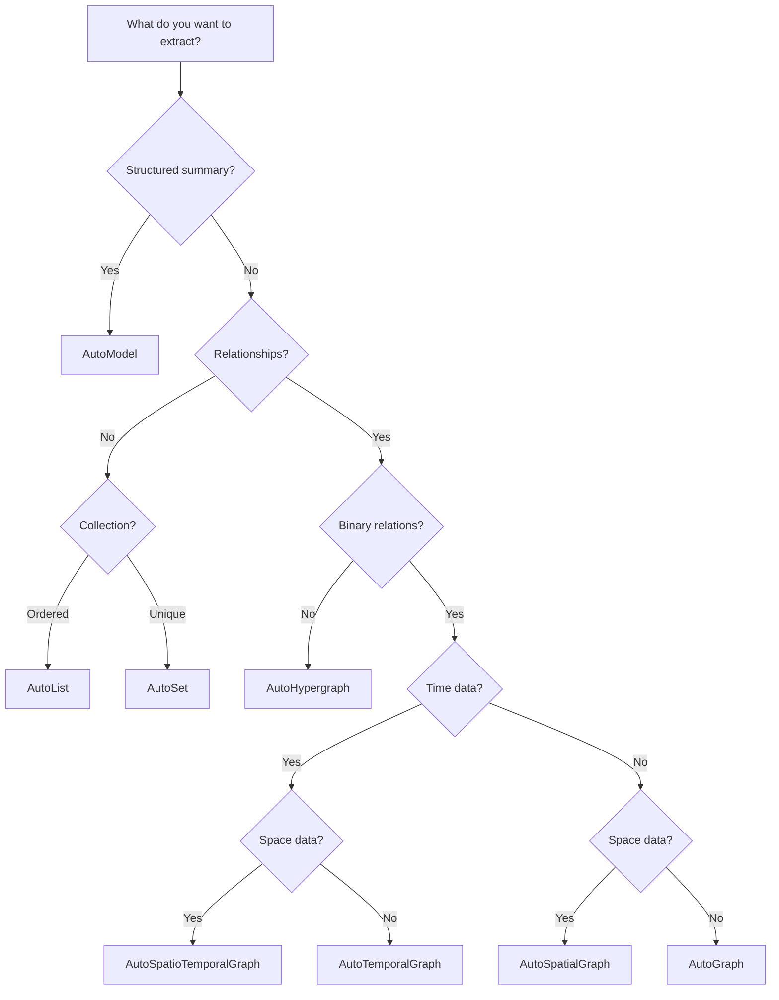

# How to Choose a Template

Decision guide for selecting the right template.

---

## Quick Decision Tree



---

## By Use Case

### People & Biographies

| Template | Output | Best For |
|----------|--------|----------|
| `general/biography_graph` | Temporal graph | Life stories, profiles |
| `general/base_model` | Model | Person summaries |

**Example:**
```bash
he parse bio.md -t general/biography_graph -l en -o ./out/
```

### Research & Documents

| Template | Output | Best For |
|----------|--------|----------|
| `general/concept_graph` | Graph | Research papers |
| `general/knowledge_graph` | Graph | Technical documents |
| `general/doc_structure` | Model | Document outlines |

### Financial

| Template | Output | Best For |
|----------|--------|----------|
| `finance/earnings_summary` | Model | Earnings reports |
| `finance/ownership_graph` | Graph | Company structures |
| `finance/event_timeline` | Temporal | Financial events |
| `finance/risk_factor_set` | Set | Risk assessments |

### Legal

| Template | Output | Best For |
|----------|--------|----------|
| `legal/contract_obligation` | List | Contract terms |
| `legal/case_citation` | Graph | Legal precedents |
| `legal/case_fact_timeline` | Temporal | Case chronologies |

### Medical

| Template | Output | Best For |
|----------|--------|----------|
| `medicine/anatomy_graph` | Graph | Anatomy texts |
| `medicine/drug_interaction` | Graph | Drug information |
| `medicine/treatment_map` | Graph | Treatment protocols |

---

## By Output Type

### I need a summary/report → AutoModel

```python
# Financial summary
ka = Template.create("finance/earnings_summary", "en")

# Patient discharge
ka = Template.create("medicine/discharge_instruction", "en")
```

### I need a list → AutoList

```python
# Compliance checklist
ka = Template.create("legal/compliance_list", "en")

# Symptoms
ka = Template.create("medicine/symptom_list", "en")
```

### I need unique items → AutoSet

```python
# Risk factors
ka = Template.create("finance/risk_factor_set", "en")

# Key terms
ka = Template.create("legal/defined_term_set", "en")
```

### I need a network → AutoGraph

```python
# General knowledge
ka = Template.create("general/knowledge_graph", "en")

# Company ownership
ka = Template.create("finance/ownership_graph", "en")
```

### I need a timeline → AutoTemporalGraph

```python
# Biography
ka = Template.create("general/biography_graph", "en")

# Event sequence
ka = Template.create("finance/event_timeline", "en")
```

---

## By Document Language

### English Documents

All templates support English:

```bash
he parse doc.md -t general/biography_graph -l en
```

### Chinese Documents

All templates support Chinese:

```bash
he parse doc.md -t general/biography_graph -l zh
```

**Tip:** Use the language matching your document for best results.

---

## By Document Size

### Short Documents (< 1000 words)

Any template works well. Consider:
- AutoModel for summaries
- AutoGraph for relationships

### Medium Documents (1000-5000 words)

Most templates work well:
- Biography graphs
- Concept graphs
- Knowledge graphs

### Long Documents (> 5000 words)

Consider chunking or using RAG methods:
- Use with `method/light_rag`
- Or split document into sections

---

## Examples by Scenario

### Scenario 1: Research Paper Analysis

**Need:** Extract key concepts and their relationships

**Solution:**
```bash
he parse paper.md -t general/concept_graph -l en -o ./paper_kb/
```

### Scenario 2: Financial Report

**Need:** Extract earnings metrics

**Solution:**
```bash
he parse 10k.md -t finance/earnings_summary -l en -o ./earnings/
```

### Scenario 3: Legal Contract

**Need:** Extract obligations and deadlines

**Solution:**
```bash
he parse contract.md -t legal/contract_obligation -l en -o ./contract/
```

### Scenario 4: Medical Case

**Need:** Track patient timeline

**Solution:**
```bash
he parse case.md -t medicine/hospital_timeline -l en -o ./case/
```

---

## When to Use Methods Instead

Templates don't fit your need? Use methods directly:

```python
# For large documents
ka = Template.create("method/graph_rag")

# For specific algorithms
ka = Template.create("method/itext2kg")
```

→ [Choosing Methods](../python/guides/choosing-methods.md)

---

## Getting Help

### List All Templates

```bash
he list template
```

### Search Templates

```python
from hyperextract import Template

# Search by keyword
results = Template.list(filter_by_query="finance")
```

### Check Template Details

```python
cfg = Template.get("general/biography_graph")
print(cfg.description)
```

---

## See Also

- [Browse All Templates](browse.md)
- [Template Library](index.md)
- [Custom Templates](../python/guides/custom-templates.md)
