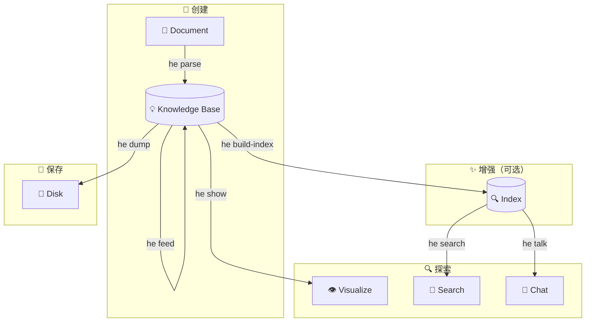

# CLI 指南

Hyper-Extract CLI (`he`) 提供了强大、易用的界面，可直接从终端进行知识提取。

---

## 安装

=== "uv (推荐)"

    ```bash
    uv pip install hyper-extract
    ```

=== "pip"

    ```bash
    pip install hyper-extract
    ```

验证安装：

```bash
he --version
```

---

## 快速命令参考

| 命令 | 用途 | 常用参数 |
|---------|---------|--------------|
| `he parse` | 从文档提取知识 | `-t` 模板, `-o` 输出, `-l` 语言 |
| `he show` | 可视化知识图谱 | — |
| `he search` | 知识库语义搜索 | `-n` top-k 结果数 |
| `he talk` | 与知识库对话 | `-i` 交互模式, `-q` 查询 |
| `he feed` | 增量添加文档 | — |
| `he info` | 显示知识库统计信息 | — |
| `he build-index` | 构建/重建搜索索引 | `-f` 强制重建 |
| `he list` | 列出模板和方法 | `template` 或 `method` |
| `he config` | 管理配置 | `init`, `show`, `set` |

---

## 完整工作流程

提取和交互知识的典型工作流程：



1. **创建** — 从文档提取知识 (`he parse`)
2. **增强** — 增量添加文档 (`he feed`)、构建索引 (`he build-index`)
3. **探索** — 可视化 (`he show`)、搜索 (`he search`)、对话 (`he talk`)
4. **保存** — 持久化到磁盘 (`he dump`)

→ [详细工作流程指南](workflow.md)

---

## 快速开始

### 1. 配置 API 密钥

```bash
he config init -k YOUR_OPENAI_API_KEY
```

### 2. 提取知识

```bash
he parse document.md -t general/biography_graph -o ./output/ -l en
```

### 3. 可视化

```bash
he show ./output/
```

---

## 详细命令

### 知识提取

- **[`he parse`](commands/parse.md)** — 从文档提取知识
- **[`he feed`](commands/feed.md)** — 向现有知识库添加文档

### 探索

- **[`he show`](commands/show.md)** — 可视化知识图谱
- **[`he search`](commands/search.md)** — 语义搜索
- **[`he talk`](commands/talk.md)** — 与知识库对话
- **[`he info`](commands/info.md)** — 查看知识库统计信息

### 管理

- **[`he build-index`](commands/build-index.md)** — 构建搜索索引
- **[`he list`](commands/list.md)** — 列出可用模板/方法
- **[`he config`](commands/config.md)** — 配置管理

---

## 配置

CLI 在 `~/.he/config.toml` 存储配置。

→ [配置参考](configuration.md)

---

## 模板 vs 方法

Hyper-Extract 提供两种提取知识的方式：

### 模板（适用于大多数用户）

特定领域的开箱即用配置：

```bash
he parse doc.md -t general/biography_graph -l en
```

### 方法（高级）

底层提取算法：

```bash
he parse doc.md -m light_rag
```

→ [了解何时使用每种方式](../concepts/architecture.md)

---

## 语言支持

模板支持多种语言：

```bash
# 英文
he parse doc.md -t general/biography_graph -l en

# 中文
he parse doc.md -t general/biography_graph -l zh
```

方法模板始终使用英文提示。

---

## 用例示例

### 研究

```bash
# 从研究论文提取
he parse paper.md -t general/concept_graph -o ./paper_kb/ -l en

# 提问
he talk ./paper_kb/ -q "主要贡献是什么？"
```

### 传记分析

```bash
# 从传记提取
he parse biography.md -t general/biography_graph -o ./bio_kb/ -l en

# 可视化生平事件
he show ./bio_kb/
```

### 法律文档分析

```bash
# 提取合同义务
he parse contract.md -t legal/contract_obligation -o ./contract_kb/ -l en

# 搜索特定条款
he search ./contract_kb/ "termination conditions"
```

---

## 技巧和最佳实践

1. **为特定领域任务使用模板** — 针对特定用例进行了优化
2. **构建索引** — 搜索和聊天功能需要索引
3. **增量摄入** — 随着时间添加文档，无需重新处理
4. **选择正确的语言** — 改善非英文文档的提取质量

---

## 获取帮助

- 查看任何命令的帮助：`he <command> --help`
- 列出所有模板：`he list template`
- 列出所有方法：`he list method`
- [常见问题](../resources/faq.md)
- [故障排除](../resources/troubleshooting.md)
