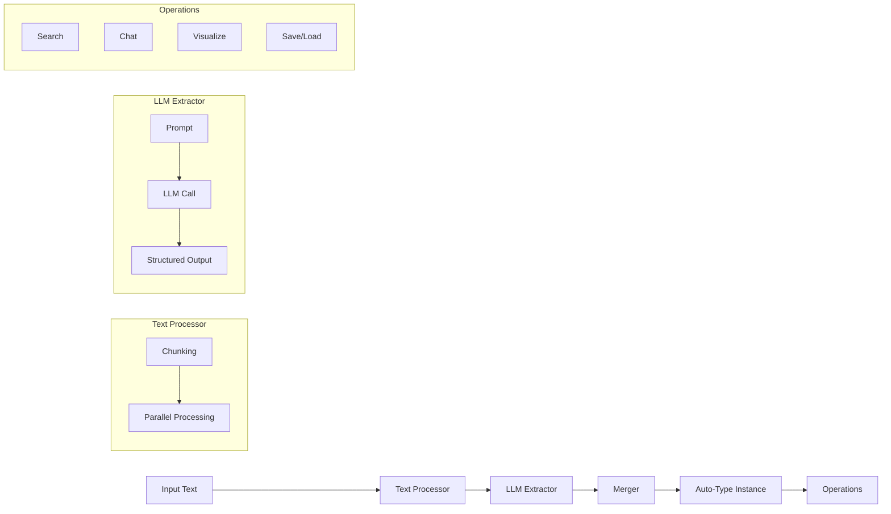

# 架构

深入了解 Hyper-Extract 的系统设计和数据流。

---

## 系统概览



---

## 数据流

### 1. 输入处理

```python
# 输入：原始文本
text = "Nikola Tesla was an inventor..."

# 如果 text > chunk_size，拆分为块
chunks = [
    "Nikola Tesla was an inventor...",
    "He developed the AC system...",
    # ...
]
```

**分块策略：**
- 默认大小：2048 字符
- 重叠：256 字符
- 分隔符：段落、句子、单词

### 2. 提取

```python
# 每个块并行处理
for chunk in chunks:
    # LLM 提取结构化数据
    data = llm.extract(chunk, schema=AutoTypeSchema)
```

**流程：**
1. 使用块格式化提示
2. 使用结构化输出调用 LLM
3. 将响应解析为 Pydantic 模型

### 3. 合并

```python
# 合并所有块的结果
final_data = merge(chunk_results)
```

**合并操作：**
- 实体去重
- 组合关系
- 解决冲突

### 4. 结果

```python
# 带提取数据的 Auto-Type 实例
result = AutoTypeInstance(data=final_data)
```

---

## 组件详情

### 模板引擎

```
Template YAML → Parser → Configuration → Factory → Auto-Type Instance
```

组件：
- **Gallery** — 模板发现和列表
- **Parser** — YAML 解析和验证
- **Factory** — 实例创建

### Auto-Type 基类

```python
class BaseAutoType:
    # 核心功能
    def parse(text) -> AutoType
    def feed_text(text) -> AutoType
    
    # 查询
    def build_index()
    def search(query) -> List[Item]
    def chat(query) -> Response
    
    # 持久化
    def dump(path)
    def load(path)
    
    # 可视化
    def show()
```

### 方法注册表

```python
# 方法在导入时注册
_METHOD_REGISTRY = {
    "light_rag": {
        "class": Light_RAG,
        "type": "graph",
        "description": "..."
    },
    # ...
}
```

---

## 扩展点

### 自定义模板

创建特定领域模板：

```yaml
# my_template.yaml
name: custom_extraction
type: graph
output:
  entities:
    fields:
      - name: name
        type: str
# ...
```

### 自定义自动类型

扩展基类：

```python
from hyperextract.types import AutoGraph

class MyCustomGraph(AutoGraph):
    def _default_prompt(self):
        return "Custom prompt..."
```

### 自定义方法

实现提取算法：

```python
from hyperextract.methods import register_method

class MyMethod:
    def extract(self, text):
        # 自定义提取逻辑
        pass

register_method("my_method", MyMethod, "graph", "Description")
```

---

## 性能考虑

### 分块

| 文档大小 | 块数 | 处理时间 |
|---------------|--------|-----------------|
| < 2KB | 1 | 快 |
| 2-10KB | 2-5 | 中等 |
| 10-50KB | 5-25 | 慢 |
| > 50KB | 25+ | 非常慢 |

### 并行化

```python
# 默认：10 个并发工作线程
# 可通过配置调整
max_workers = 10
```

### 内存使用

```python
# 索引内存估算
# 每个实体/关系约 1KB
```

---

## 设计原则

1. **类型安全** — 全程使用 Pydantic schema
2. **可扩展性** — 方法的插件架构
3. **可用性** — 常见任务的模板
4. **性能** — 分块和并行化
5. **互操作性** — 标准格式（JSON、YAML）

---

## 另请参见

- [自动类型](autotypes.md)
- [方法](methods.md)
- [模板格式](templates-format.md)
