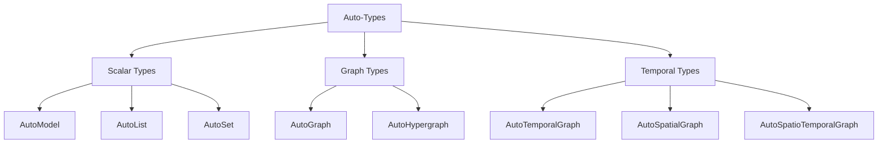

# 自动类型

8 种知识结构类型的完整指南。

---

## 概述

自动类型是智能数据结构，具有以下功能：
- 定义提取输出格式
- 提供类型安全的 schema
- 包含内置操作（搜索、可视化等）
- 支持序列化

---

## 8 种自动类型



---

## 标量类型

### AutoModel

**目的**：单个结构化对象

**使用场景**：
- 提取摘要/报告
- 具有已知字段的结构化数据
- 具有许多属性的单个实体

**示例输出**：
```python
{
    "name": "苏轼",
    "style_name": "子瞻",
    "art_name": "东坡居士",
    "dynasty": "北宋",
    "birth_year": 1037,
    "masterpiece": "念奴娇·赤壁怀古"
}
```

**常用模板**：
- `finance/earnings_summary`
- `general/base_model`

---

### AutoList

**目的**：有序集合

**使用场景**：
- 顺序很重要
- 排名项目
- 简单的时间线事件

**示例输出**：
```python
{
    "items": [
        {"name": "《念奴娇·赤壁怀古》", "year": 1082},
        {"name": "《水调歌头·明月几时有》", "year": 1076},
        {"name": "《赤壁赋》", "year": 1082}
    ]
}
```

**常用模板**：
- `general/base_list`
- `legal/compliance_list`

---

### AutoSet

**目的**：去重集合

**使用场景**：
- 仅唯一项目
- 标签/类别
- 成员资格测试

**示例输出**：
```python
{
    "items": [
        "豪放词",
        "行书",
        "文人画",
        "宋四家"
    ]
}
```

**常用模板**：
- `general/base_set`
- `finance/risk_factor_set`

---

## 图谱类型

### AutoGraph

**目的**：实体关系网络

**使用场景**：
- 人物、组织、概念
- 二元关系
- 知识图谱

**示例输出**：
```python
{
    "nodes": [
        {"name": "苏轼", "type": "人物"},
        {"name": "苏辙", "type": "人物"},
        {"name": "欧阳修", "type": "人物"},
        {"name": "《赤壁赋》", "type": "作品"}
    ],
    "edges": [
        {"source": "苏轼", "target": "苏辙", "type": "兄弟"},
        {"source": "苏轼", "target": "欧阳修", "type": "师生"},
        {"source": "苏轼", "target": "《赤壁赋》", "type": "创作"}
    ]
}
```

**常用模板**：
- `general/knowledge_graph`
- `general/biography_graph`

---

### AutoHypergraph

**目的**：多实体关系

**使用场景**：
- 关系涉及 3+ 个实体
- 复杂交互
- N 元关联

**示例输出**：
```python
{
    "nodes": [...],
    "edges": [
        {
            "entities": ["苏轼", "苏辙", "苏洵"],
            "type": "三苏",
            "description": "父子三人同列唐宋八大家"
        }
    ]
}
```

**常用模板**：
- `general/base_hypergraph`

---

## 时序类型

### AutoTemporalGraph

**目的**：图谱 + 时间信息

**使用场景**：
- 时间线很重要
- 事件序列
- 历史分析

**示例输出**：
```python
{
    "nodes": [...],
    "edges": [
        {
            "source": "苏轼",
            "target": "《念奴娇·赤壁怀古》",
            "type": "创作",
            "time": "1082"
        },
        {
            "source": "苏轼",
            "target": "黄州",
            "type": "贬谪",
            "time": "1080-1084"
        }
    ]
}
```

**常用模板**：
- `general/base_temporal_graph`
- `finance/event_timeline`

---

### AutoSpatialGraph

**目的**：图谱 + 位置信息

**使用场景**：
- 地理数据
- 基于位置的分析
- 映射

**示例输出**：
```python
{
    "nodes": [
        {
            "name": "黄州",
            "type": "地点",
            "coordinates": "湖北省黄冈市"
        }
    ],
    "edges": [
        {
            "source": "苏轼",
            "target": "黄州",
            "type": "躬耕",
            "location": "东坡"
        }
    ]
}
```

**常用模板**：
- `general/base_spatial_graph`

---

### AutoSpatioTemporalGraph

**目的**：图谱 + 时间 + 空间

**使用场景**：
- 需要完整上下文
- 历史地理
- 带时间和地点的事件分析

**示例输出**：
```python
{
    "nodes": [...],
    "edges": [
        {
            "source": "苏轼",
            "target": "《赤壁赋》",
            "type": "创作",
            "time": "1082",
            "location": "黄州",
            "description": "夜游赤壁，饮酒赋诗"
        }
    ]
}
```

**常用模板**：
- `general/base_spatio_temporal_graph`

---

## 选择指南

### 决策树

```
需要提取什么？
│
├─ 单个结构化对象 → AutoModel
│
├─ 项目集合
│   ├─ 有序/排名 → AutoList
│   └─ 唯一/标签 → AutoSet
│
└─ 关系
    ├─ 简单（二元）
    │   ├─ 带时间 → AutoTemporalGraph
    │   ├─ 带空间 → AutoSpatialGraph
    │   ├─ 两者都 → AutoSpatioTemporalGraph
    │   └─ 两者都不 → AutoGraph
    │
    └─ 复杂（多实体）
        └─ AutoHypergraph
```

### 按用例

| 用例 | 推荐类型 |
|----------|------------------|
| 公司报告 | AutoModel |
| Top 10 列表 | AutoList |
| 标签/关键词 | AutoSet |
| 人物网络 | AutoGraph |
| 项目团队 | AutoHypergraph |
| 传记时间线 | AutoTemporalGraph |
| 旅行日志 | AutoSpatialGraph |
| 历史事件 | AutoSpatioTemporalGraph |

---

## 常见操作

所有自动类型都支持：

```python
# 提取
result = ka.parse(text)

# 增量更新
result.feed_text(more_text)

# 构建索引（搜索、聊天和交互式可视化都需要）
result.build_index()

# 搜索
results = result.search("query")

# 聊天
response = result.chat("question")

# 可视化（支持搜索/对话的交互式可视化）
result.show()

# 持久化
result.dump("./path/")
result.load("./path/")

# 检查空
if result.empty():
    print("No data")

# 清除
result.clear()
result.clear_index()
```

---

## 另请参见

- [使用自动类型](../python/guides/working-with-autotypes.md)
- [模板库](../templates/index.md)
- [方法](methods.md)
