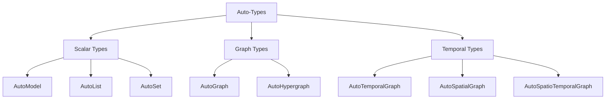

# 自动类型

8 种知识结构类型的完整指南。

---

## 概述

自动类型是智能数据结构，具有以下功能：
- 定义提取输出格式
- 提供类型安全的 schema
- 包含内置操作（搜索、可视化等）
- 支持序列化

---

## 8 种自动类型



---

## 标量类型

### AutoModel

**目的**：单个结构化对象

**使用场景**：
- 提取摘要/报告
- 具有已知字段的结构化数据
- 具有许多属性的单个实体

**示例输出**：
```python
{
    "company_name": "Tesla Inc",
    "revenue": 81.46,
    "eps": 4.07,
    "employees": 127855
}
```

**常用模板**：
- `finance/earnings_summary`
- `general/base_model`

---

### AutoList

**目的**：有序集合

**使用场景**：
- 顺序很重要
- 排名项目
- 简单的时间线事件

**示例输出**：
```python
{
    "items": [
        {"name": "AC Motor", "year": 1888},
        {"name": "Tesla Coil", "year": 1891},
        {"name": "Radio", "year": 1898}
    ]
}
```

**常用模板**：
- `general/base_list`
- `legal/compliance_list`

---

### AutoSet

**目的**：去重集合

**使用场景**：
- 仅唯一项目
- 标签/类别
- 成员资格测试

**示例输出**：
```python
{
    "items": [
        "Electrical Engineering",
        "Physics",
        "Invention",
        "Renewable Energy"
    ]
}
```

**常用模板**：
- `general/base_set`
- `finance/risk_factor_set`

---

## 图谱类型

### AutoGraph

**目的**：实体关系网络

**使用场景**：
- 人物、组织、概念
- 二元关系
- 知识图谱

**示例输出**：
```python
{
    "nodes": [
        {"name": "Tesla", "type": "person"},
        {"name": "Edison", "type": "person"},
        {"name": "AC Motor", "type": "invention"}
    ],
    "edges": [
        {"source": "Tesla", "target": "AC Motor", "type": "invented"},
        {"source": "Tesla", "target": "Edison", "type": "rivals"}
    ]
}
```

**常用模板**：
- `general/knowledge_graph`
- `general/biography_graph`

---

### AutoHypergraph

**目的**：多实体关系

**使用场景**：
- 关系涉及 3+ 个实体
- 复杂交互
- N 元关联

**示例输出**：
```python
{
    "nodes": [...],
    "edges": [
        {
            "entities": ["Tesla", "Westinghouse", "Niagara"],
            "type": "collaboration",
            "description": "Power plant project"
        }
    ]
}
```

**常用模板**：
- `general/base_hypergraph`

---

## 时序类型

### AutoTemporalGraph

**目的**：图谱 + 时间信息

**使用场景**：
- 时间线很重要
- 事件序列
- 历史分析

**示例输出**：
```python
{
    "nodes": [...],
    "edges": [
        {
            "source": "Tesla",
            "target": "AC Motor",
            "type": "invented",
            "time": "1888"
        },
        {
            "source": "Tesla",
            "target": "Wardenclyffe Tower",
            "type": "built",
            "time": "1901-1902"
        }
    ]
}
```

**常用模板**：
- `general/base_temporal_graph`
- `finance/event_timeline`

---

### AutoSpatialGraph

**目的**：图谱 + 位置信息

**使用场景**：
- 地理数据
- 基于位置的分析
- 映射

**示例输出**：
```python
{
    "nodes": [
        {
            "name": "Colorado Springs",
            "type": "location",
            "coordinates": "38.8339,-104.8214"
        }
    ],
    "edges": [
        {
            "source": "Tesla",
            "target": "Colorado Springs",
            "type": "conducted_experiments",
            "location": "Colorado Springs"
        }
    ]
}
```

**常用模板**：
- `general/base_spatial_graph`

---

### AutoSpatioTemporalGraph

**目的**：图谱 + 时间 + 空间

**使用场景**：
- 需要完整上下文
- 历史地理
- 带时间和地点的事件分析

**示例输出**：
```python
{
    "nodes": [...],
    "edges": [
        {
            "source": "Tesla",
            "target": "AC Motor",
            "type": "demonstrated",
            "time": "1888",
            "location": "Pittsburgh",
            "description": "Demonstration at Westinghouse"
        }
    ]
}
```

**常用模板**：
- `general/base_spatio_temporal_graph`

---

## 选择指南

### 决策树

```
需要提取什么？
│
├─ 单个结构化对象 → AutoModel
│
├─ 项目集合
│   ├─ 有序/排名 → AutoList
│   └─ 唯一/标签 → AutoSet
│
└─ 关系
    ├─ 简单（二元）
    │   ├─ 带时间 → AutoTemporalGraph
    │   ├─ 带空间 → AutoSpatialGraph
    │   ├─ 两者都 → AutoSpatioTemporalGraph
    │   └─ 两者都不 → AutoGraph
    │
    └─ 复杂（多实体）
        └─ AutoHypergraph
```

### 按用例

| 用例 | 推荐类型 |
|----------|------------------|
| 公司报告 | AutoModel |
| Top 10 列表 | AutoList |
| 标签/关键词 | AutoSet |
| 人物网络 | AutoGraph |
| 项目团队 | AutoHypergraph |
| 传记时间线 | AutoTemporalGraph |
| 旅行日志 | AutoSpatialGraph |
| 历史事件 | AutoSpatioTemporalGraph |

---

## 常见操作

所有自动类型都支持：

```python
# 提取
result = ka.parse(text)

# 增量更新
result.feed_text(more_text)

# 搜索（需要索引）
result.build_index()
results = result.search("query")

# 聊天（需要索引）
response = result.chat("question")

# 可视化
result.show()

# 持久化
result.dump("./path/")
result.load("./path/")

# 检查空
if result.empty():
    print("No data")

# 清除
result.clear()
result.clear_index()
```

---

## 另请参见

- [使用自动类型](../python/guides/working-with-autotypes.md)
- [模板库](../templates/index.md)
- [方法](methods.md)
