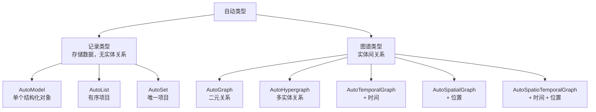

# 自动类型

了解 8 种知识结构类型：它们是什么以及何时使用。

---

## 什么是自动类型？

自动类型是定义提取知识如何组织的智能数据结构。可以将它们视为塑造文档输出结果的"容器"。

核心特性：

| 特性 | 描述 |
|----------------|-------------|
| **类型安全** | 基于 Pydantic 的验证确保数据一致性 |
| **自包含** | 内置操作（搜索、可视化、保存） |
| **可序列化** | 可保存到磁盘，稍后加载 |
| **可组合** | 可合并、更新、增量扩展 |

---

## 8 种自动类型

分为两个类别：



---

## 记录类型

用于**记录和存储数据**，不涉及实体之间的关系。

记录类型提取的是**独立的数据项**，每个项目本身不包含与其他项目的关联信息。

### AutoModel

**用途**：提取单个结构化对象

**类比**：一个需要填写的表单

**示例用例**：
- 公司财报（收入、利润、增长）
- 产品规格（名称、价格、特性）
- 个人档案（姓名、出生日期、职业）

**示例输出结构**：
```json
{
    "company_name": "Tesla Inc",
    "revenue": 81.46,
    "employees": 127855
}
```

**常用模板**：`finance/earnings_summary`, `general/model`

---

### AutoList

**用途**：提取有序集合

**类比**：排名列表或序列

**示例用例**：
- 史上十佳电影
- 分步骤流程
- 时间线事件（简单时间顺序列表）

**示例输出结构**：
```json
{
    "items": [
        {"name": "Tesla Coil", "year": 1891},
        {"name": "Radio", "year": 1898}
    ]
}
```

**关键特性**：顺序很重要 - 项目按序列排列

**常用模板**：`general/list`, `legal/compliance_list`

---

### AutoSet

**用途**：提取唯一项目（无重复）

**类比**：一组唯一的标签

**示例用例**：
- 文档关键词
- 类别或标签
- 技能集合

**示例输出结构**：
```json
{
    "items": ["Electrical Engineering", "Physics", "Invention"]
}
```

**关键特性**：自动去重

**常用模板**：`general/set`, `finance/risk_factor_set`

---

## 图谱类型

用于表示**实体之间的关系**。图谱类型不仅包含实体本身（节点），还包含实体之间的连接（边）。

图谱类型根据关系的复杂程度和附加的维度信息，分为以下几种子类型：

### 基础图谱

#### AutoGraph

**用途**：提取二元关系（一次两个实体）

**类比**：社交网络图

**示例用例**：
- 人际关系（合作过、结婚）
- 概念关系（is-a、part-of）
- 组织互动

**示例输出结构**：
```json
{
    "nodes": [
        {"name": "Tesla", "type": "person"},
        {"name": "AC Motor", "type": "invention"}
    ],
    "edges": [
        {"source": "Tesla", "target": "AC Motor", "type": "invented"}
    ]
}
```

**关键特性**：每个关系连接恰好两个实体

**常用模板**：`general/graph`, `general/biography_graph`

---

#### AutoHypergraph

**用途**：提取涉及 3+ 实体的关系

**类比**：多人协作的项目团队

**示例用例**：
- 多方协作
- 复杂交互（买方、卖方、经纪人）
- 群体成员关系

**示例输出结构**：
```json
{
    "nodes": [...],
    "edges": [
        {
            "entities": ["Tesla", "Westinghouse", "Niagara"],
            "type": "collaboration"
        }
    ]
}
```

**关键特性**：一个"边"可连接多个实体

**常用模板**：`general/base_hypergraph`

---

### 增强图谱（带维度信息）

在基础图谱上增加了**时间**或**空间**维度，用于更丰富的关系描述。

#### AutoTemporalGraph（时序图谱）

**用途**：提取带时间信息的关系

**类比**：带连接的时间线

**示例用例**：
- 传记（带日期的生活事件）
- 项目历史
- 历史分析

**示例输出结构**：
```json
{
    "edges": [
        {
            "source": "Tesla",
            "target": "AC Motor",
            "type": "invented",
            "time": "1888"
        }
    ]
}
```

**关键特性**：每个关系都有时间组件

**常用模板**：`general/base_temporal_graph`, `finance/event_timeline`

---

#### AutoSpatialGraph（空间图谱）

**用途**：提取带位置信息的关系

**类比**：带连接的地图

**示例用例**：
- 旅行日志
- 地理网络
- 基于位置的资产追踪

**示例输出结构**：
```json
{
    "entities": [
        {"name": "Colorado Springs", "location": "38.83,-104.82"}
    ],
    "relations": [
        {
            "source": "Tesla",
            "target": "Colorado Springs",
            "type": "conducted_experiments"
        }
    ]
}
```

**关键特性**：实体或关系具有地理坐标

**常用模板**：`general/base_spatial_graph`

---

#### AutoSpatioTemporalGraph（时空图谱）

**用途**：提取同时带时间和地点的关系

**类比**：带日期事件的历史地图

**示例用例**：
- 军事历史（带时间和地点的战役）
- 流行病追踪
- 历史迁徙

**示例输出结构**：
```json
{
    "relations": [
        {
            "source": "Tesla",
            "target": "AC Motor",
            "type": "demonstrated",
            "time": "1888",
            "location": "Pittsburgh"
        }
    ]
}
```

**关键特性**：完整上下文 - 谁、什么、何时、何地

**常用模板**：`general/base_spatio_temporal_graph`

---

## 选择指南

### 决策树

```
你需要提取什么？
│
├─ 单个结构化对象（如表单）
│  └─ AutoModel
│
├─ 项目集合
│  ├─ 顺序重要？ → AutoList
│  └─ 仅需唯一项目？ → AutoSet
│
└─ 实体之间的关系 → 图谱类型
   ├─ 关系数量
   │  ├─ 二元关系（2个实体）→ 基础图谱
   │  │  ├─ 需要时间信息？ → AutoTemporalGraph
   │  │  ├─ 需要位置信息？ → AutoSpatialGraph
   │  │  ├─ 两者都需要？ → AutoSpatioTemporalGraph
   │  │  └─ 都不需要？ → AutoGraph
   │  │
   │  └─ 多元关系（3+个实体）→ AutoHypergraph
```

### 按用例选择

| 用例 | 自动类型 | 原因 |
|----------|-----------|-----|
| 公司财报 | AutoModel | 单结构摘要 |
| Top 10 列表 | AutoList | 有序/排名项目 |
| 关键词/标签 | AutoSet | 唯一集合 |
| 人际网络 | AutoGraph | 二元关系 |
| 项目团队 | AutoHypergraph | 多人协作 |
| 传记时间线 | AutoTemporalGraph | 带日期事件 |
| 旅行行程 | AutoSpatialGraph | 带连接地点 |
| 历史事件 | AutoSpatioTemporalGraph | 需要完整上下文 |

### 快速参考

#### 记录类型

| 自动类型 | 输出形状 | 关键特性 |
|-----------|--------------|-------------|
| AutoModel | 单个对象 | 固定 schema 字段 |
| AutoList | 数组 | 保持顺序 |
| AutoSet | 数组 | 去重 |

#### 图谱类型

| 自动类型 | 输出形状 | 关键特性 |
|-----------|--------------|-------------|
| AutoGraph | 节点 + 边 | 二元关系（2个实体） |
| AutoHypergraph | 节点 + 超边 | 多实体关系（3+个实体） |
| AutoTemporalGraph | 节点 + 时间边 | 二元关系 + 时间维度 |
| AutoSpatialGraph | 节点 + 地理边 | 二元关系 + 地理维度 |
| AutoSpatioTemporalGraph | 节点 + 时空边 | 二元关系 + 时间 + 空间 |

---

## 下一步

准备好使用自动类型了吗？选择你的路径：

**快速开始**：使用内置[模板](../templates/index.md) — 无需了解自动类型

**更多控制**：学习如何在 Python 中使用自动类型：
- [使用自动类型](../python/guides/working-with-autotypes.md) — 实践示例
- [Python SDK 快速入门](../python/quickstart.md) — 5 分钟上手

**高级用法**：创建自定义自动类型配置
- [创建自定义模板](../python/guides/custom-templates.md)
- [API 参考](../python/api-reference/autotypes/base.md)
