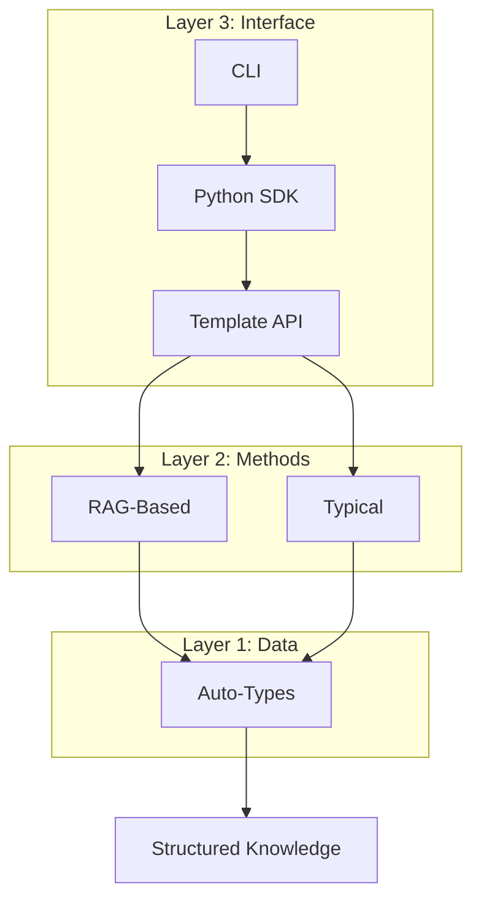

# 核心概念

了解 Hyper-Extract 的基本概念。

---

## 三层架构

Hyper-Extract 构建在三层架构之上：

| 层级 | 目的 | 组件 |
|-------|---------|------------|
| **自动类型** | 定义数据结构 | 8 种类型类 |
| **方法** | 提取算法 | RAG + 典型方法 |
| **模板** | 特定领域配置 | 80+ 预设模板 |

---

## 核心概念

### [自动类型](autotypes.md)

8 种定义提取输出的数据结构类型：

- **记录类型**：AutoModel、AutoList、AutoSet（存储数据，无实体关系）
- **图谱类型**：AutoGraph、AutoHypergraph、AutoTemporalGraph、AutoSpatialGraph、AutoSpatioTemporalGraph（表示实体间关系）

→ [了解自动类型](autotypes.md)

### [方法](methods.md)

提取算法：

- **基于 RAG**：GraphRAG、LightRAG、Hyper-RAG
- **典型方法**：iText2KG、KG-Gen、Atom

→ [了解方法](methods.md)

### [模板格式](templates-format.md)

定义提取模板的 YAML 格式：

- 模式定义
- 提示工程
- 指南和规则

→ [了解模板格式](templates-format.md)

### [架构](architecture.md)

深入了解系统设计：

- 数据流
- 处理管道
- 扩展点

→ [了解架构](architecture.md)

---

## 快速链接

- [CLI 文档](../cli/index.md) — 终端使用
- [Python SDK](../python/index.md) — 编程使用
- [模板库](../templates/index.md) — 可用模板
