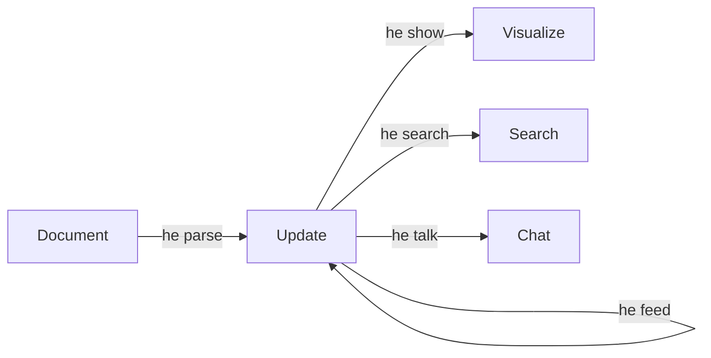

# CLI 快速入门

使用命令行从终端提取知识。

---

## 前置要求

- Hyper-Extract 已安装
- API 密钥已配置

→ 如果尚未完成，请查看[安装指南](installation.md)

---

## 快速示例

### 1. 从文档提取知识

```bash
he parse tesla.md -t general/biography_graph -o ./output/ -l en
```

这将从 `tesla.md` 中提取知识图谱并保存到 `./output/` 目录。

### 2. 可视化结果

```bash
he show ./output/
```

### 3. 搜索知识库

```bash
he search ./output/ "AC motor invention"
```

### 4. 与知识库对话

```bash
he talk ./output/ -q "What were Tesla's major inventions?"
```

---

## 完整工作流程



1. **Parse** — 从文档提取知识
2. **Show** — 可视化知识图谱
3. **Search** — 查找特定信息
4. **Talk** — 关于内容进行对话
5. **Feed** — 增量添加更多文档

---

## 常用命令

### 解析文档

```bash
# 使用模板
he parse doc.md -t general/biography_graph -o ./out/ -l en

# 使用方法
he parse doc.md -m light_rag -o ./out/
```

### 构建索引

```bash
# 构建搜索索引（搜索和聊天需要）
he build-index ./output/
```

### 查看信息

```bash
# 查看知识库统计
he info ./output/
```

---

## 下一步

- 深入了解 [CLI 命令](../cli/index.md)
- 浏览 [模板库](../templates/index.md)
- 理解 [核心概念](../concepts/index.md)
