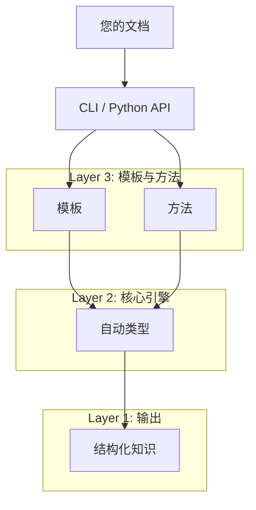

{ width="500" }

> **Transform documents into structured knowledge with one command.**
> 
> *"告别文档焦虑，让信息一目了然"*

**Hyper-Extract** 是一个智能的、由 LLM（大型语言模型）驱动的知识提取框架。它将非结构化文本转换为持久的、可预测的、强类型的知识结构——从简单的列表到复杂的知识图谱、超图谱和时空图谱。

---

## ⚡ 5分钟快速入门

=== "CLI (终端)"

    ```bash
    # 1. 安装 CLI 工具
    uv tool install hyperextract

    # 2. 配置 API 密钥
    he config init -k YOUR_OPENAI_API_KEY

    # 3. 从文档中提取知识
    he parse sushi.md -t general/biography_graph -o ./output/ -l zh

    # 4. 可视化知识图谱
    he show ./output/
    ```

=== "Python"

    ```python
    from hyperextract import Template

    # 1. 创建模板
    ka = Template.create("general/biography_graph", "zh")

    # 2. 提取知识
    with open("sushi.md") as f:
        result = ka.parse(f.read())

    # 3. 可视化
    ka.show(result)
    ```

**→ 想要深入了解？** 查看[入门指南](getting-started/index.md)或直接跳转至 [CLI](cli/index.md) / [Python SDK](python/index.md) 文档。

---

## ✨ Hyper-Extract 的独特之处

<div class="grid cards" markdown>

-   :material-shape:{ .lg .middle } **8 种自动类型**

    ---

    从简单的 `AutoList`/`AutoModel` 到高级的 `AutoGraph`、`AutoHypergraph` 和 `AutoSpatioTemporalGraph`。为您的数据选择正确的结构。

-   :material-brain:{ .lg .middle } **10+ 种提取引擎**

    ---

    内置支持 GraphRAG、LightRAG、Hyper-RAG、KG-Gen、iText2KG 等。选择最适合您用例的方法。

-   :material-file-document:{ .lg .middle } **80+ 个领域模板**

    ---

    开箱即用的金融、法律、医疗、中医和工业模板。无需配置即可使用。

-   :material-sync:{ .lg .middle } **增量演进**

    ---

    向知识库持续添加新文档。无需重新处理所有内容。

</div>

---

## 🎯 选择您的路径

<div class="grid cards" markdown>

-   :material-console:{ .lg .middle } __CLI 用户__

    ---

    直接从终端处理文档。非常适合：
    
    - 快速知识提取
    - 批量文档处理
    - 无需编码构建知识库
    
    [:octicons-arrow-right-24: CLI 指南](cli/index.md)

-   :material-language-python:{ .lg .middle } __Python 开发者__

    ---

    集成到您的 Python 应用程序中。非常适合：
    
    - 自定义提取管道
    - 与现有工作流程集成
    - 构建 AI 驱动的应用程序
    
    [:octicons-arrow-right-24: Python SDK](python/index.md)

-   :material-school:{ .lg .middle } __想了解更多？__

    ---

    了解核心概念和架构：
    
    - 自动类型如何工作
    - 选择提取方法
    - 创建自定义模板
    
    [:octicons-arrow-right-24: 核心概念](concepts/index.md)

</div>

---

## 🧩 8 种自动类型一览

| 类型 | 用例 | 示例输出 |
|------|----------|----------------|
| **AutoModel** | 结构化摘要 | 带有特定字段的 Pydantic 模型 |
| **AutoList** | 项目集合 | 实体或事实的列表 |
| **AutoSet** | 去重集合 | 唯一项目的集合 |
| **AutoGraph** | 实体关系网络 | 带节点和边的知识图谱 |
| **AutoHypergraph** | 多实体关系 | 连接多个节点的超级边 |
| **AutoTemporalGraph** | 时间关系 | 带时间信息的图谱 |
| **AutoSpatialGraph** | 位置关系 | 带地理数据的图谱 |
| **AutoSpatioTemporalGraph** | 时间 + 空间组合 | 完整的上下文信息 |

→ [了解如何选择自动类型](concepts/autotypes.md)

---

## 🏗️ 架构概述

Hyper-Extract 采用**三层架构**：



1. **自动类型** — 定义输出数据结构（8种类型）
2. **方法** — 提供提取算法（基于 RAG 和典型方法）
3. **模板** — 提供特定领域的开箱即用配置

您可以在任意层级使用 Hyper-Extract：选择模板快速获得结果，选择方法获得更多控制，或直接使用自动类型进行完全定制。

---

## 📊 与其他工具对比

| 功能 | GraphRAG | LightRAG | KG-Gen | **Hyper-Extract** |
|---------|:--------:|:--------:|:------:|:-----------------:|
| 知识图谱 | ✅ | ✅ | ✅ | ✅ |
| 时间图谱 | ✅ | ❌ | ❌ | ✅ |
| 空间图谱 | ❌ | ❌ | ❌ | ✅ |
| 超图谱 | ❌ | ❌ | ❌ | ✅ |
| 领域模板 | ❌ | ❌ | ❌ | ✅ |
| CLI 工具 | ✅ | ❌ | ❌ | ✅ |
| 多语言 | ✅ | ❌ | ❌ | ✅ |

---

## 📚 文档结构

- **[入门指南](getting-started/index.md)** — 安装和首次提取
- **[CLI 指南](cli/index.md)** — 完整的终端工作流程文档
- **[Python SDK](python/index.md)** — API 参考和开发者指南
- **[核心概念](concepts/index.md)** — 了解架构
- **[模板库](templates/index.md)** — 特定领域的提取模板
- **[资源](resources/index.md)** — 常见问题、故障排除和贡献指南

---

## 🤝 贡献

欢迎贡献！无论是错误报告、功能请求还是文档改进，请随时提交 Issue 或 Pull Request。

[:fontawesome-brands-github: GitHub 仓库](https://github.com/yifanfeng97/hyper-extract){ .md-button .md-button--primary }

---

## 📄 许可证

Hyper-Extract 采用 [Apache-2.0 许可证](https://github.com/yifanfeng97/hyper-extract/blob/main/LICENSE)。
