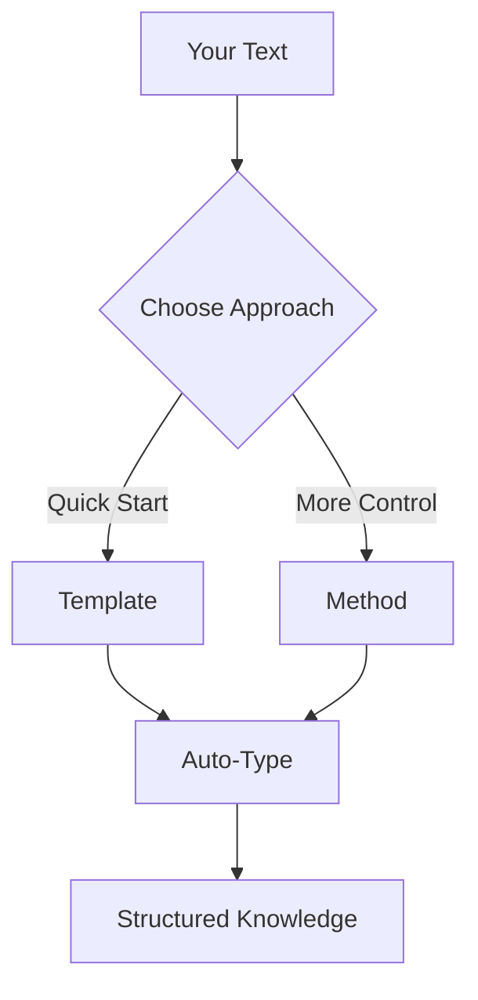
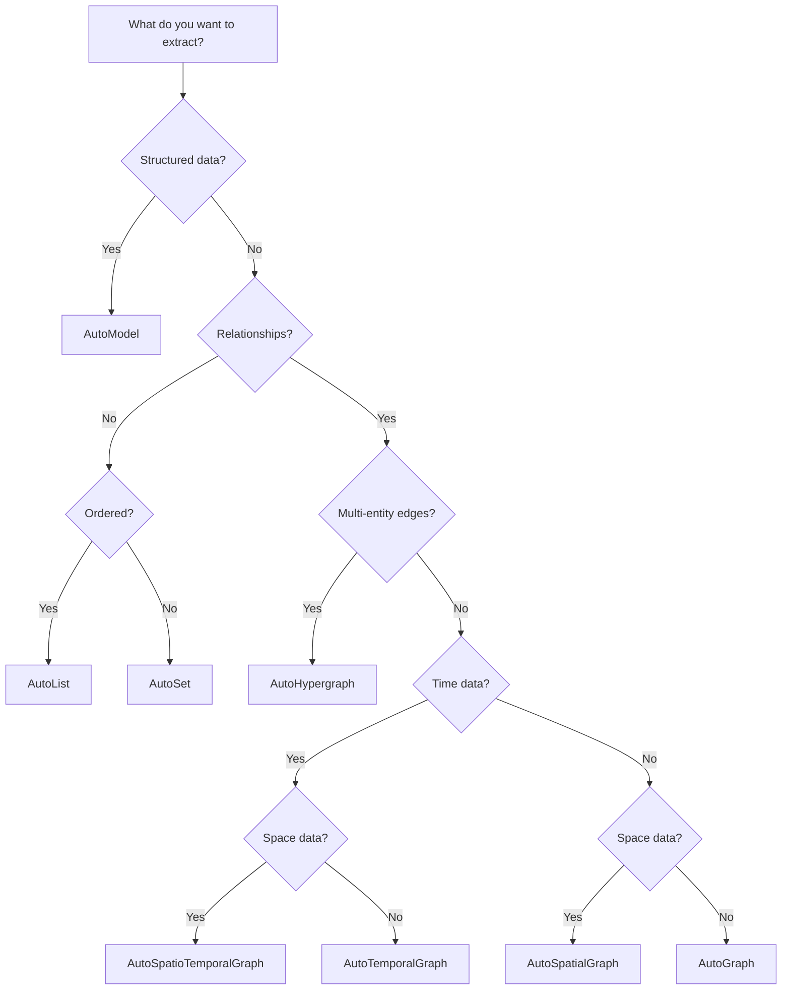

# 核心概念

理解 Hyper-Extract 的三大支柱：模板、自动类型和方法。

---

## 架构概览



---

## 模板

**模板**是针对特定领域和任务预配置的提取设置。

### 什么是模板？

模板组合了：
- **自动类型** — 输出数据结构
- **提示** — LLM 指令
- **Schema** — 字段定义
- **指南** — 提取规则

### 使用模板

```python
from hyperextract import Template

# 从预设创建
ka = Template.create("general/biography_graph", language="en")

# 从文件创建
ka = Template.create("/path/to/custom.yaml", language="en")

# 列出可用的
templates = Template.list()
for path, cfg in templates.items():
    print(f"{path}: {cfg.description}")
```

### 何时使用模板

✅ **使用模板当：**
- 您想要快速结果
- 处理常见文档类型
- 需要特定领域提取
- 不想配置提示

❌ **不使用模板当：**
- 您需要完全控制提取
- 实现自定义算法
- 研究/实验

---

## 自动类型

**自动类型**定义提取知识的输出数据结构。

### 8 种自动类型

| 类型 | 描述 | 最佳用途 |
|------|-------------|----------|
| `AutoModel` | 单个结构化对象 | 摘要、报告 |
| `AutoList` | 有序集合 | 序列、排名项目 |
| `AutoSet` | 去重集合 | 唯一项目、标签 |
| `AutoGraph` | 实体关系图谱 | 知识图谱 |
| `AutoHypergraph` | 多实体边 | 复杂关系 |
| `AutoTemporalGraph` | 图谱 + 时间 | 时间线、历史 |
| `AutoSpatialGraph` | 图谱 + 空间 | 地图、位置 |
| `AutoSpatioTemporalGraph` | 图谱 + 时间 + 空间 | 完整上下文 |

### 使用自动类型

```python
from hyperextract import Template

# 图谱提取
ka = Template.create("general/knowledge_graph", "en")
result = ka.parse(text)

# 访问图谱数据
for node in result.data.nodes:
    print(f"Node: {node.name}")

for edge in result.data.edges:
    print(f"{edge.source} --{edge.type}--> {edge.target}")
```

### 选择自动类型



---

## 方法

**方法**是底层提取算法。

### 方法类型

#### 基于 RAG 的方法

使用检索增强生成处理大型文档：

| 方法 | 描述 |
|--------|-------------|
| `graph_rag` | 基于社区的检索 |
| `light_rag` | 轻量级图谱 RAG |
| `hyper_rag` | 超图谱 RAG |
| `hypergraph_rag` | 高级超图谱 |
| `cog_rag` | 认知 RAG |

#### 典型方法

直接提取方法：

| 方法 | 描述 |
|--------|-------------|
| `itext2kg` | 基于三元组的提取 |
| `itext2kg_star` | 增强版 iText2KG |
| `kg_gen` | 知识图谱生成器 |
| `atom` | 带证据的时序方法 |

### 使用方法

```python
from hyperextract import Template

# 从方法创建
ka = Template.create("method/light_rag")

# 或通过路径
ka = Template.create("method/graph_rag")
```

### 模板 vs 方法

| 方面 | 模板 | 方法 |
|--------|----------|--------|
| **易用性** | ⭐⭐⭐ | ⭐⭐ |
| **灵活性** | ⭐⭐ | ⭐⭐⭐ |
| **领域匹配** | ⭐⭐⭐ | ⭐⭐ |
| **配置** | 最小 | 更多 |
| **语言** | 多语言 | 英文 |

---

## 提取管道

### 1. 文本输入

```python
text = "Your document content here..."
```

### 2. 分块（如需要）

长文档会自动拆分：
- 默认块大小：2048 字符
- 重叠：256 字符
- 多工作线程并行处理

### 3. LLM 提取

每个块由 LLM 处理：
- 使用 Pydantic schema 进行结构化输出
- 并发处理提高速度
- 合并所有块的结果

### 4. 结果

```python
result = ka.parse(text)

# result 包含：
# - result.data: 提取的知识
# - result.metadata: 提取信息
# - 搜索、聊天、保存方法
```

---

## 综合运用

### 模板方法（推荐）

```python
from hyperextract import Template

# 1. 选择模板
ka = Template.create("general/biography_graph", "en")

# 2. 提取
result = ka.parse(text)

# 3. 使用
result.show()
```

### 方法方法（高级）

```python
from hyperextract import Template

# 1. 选择方法
ka = Template.create("method/light_rag")

# 2. 提取
result = ka.parse(text)

# 3. 使用
result.build_index()
results = result.search("query")
```

### 直接使用自动类型（完全控制）

```python
from hyperextract import AutoGraph
from langchain_openai import ChatOpenAI, OpenAIEmbeddings

# 1. 定义 schema
from pydantic import BaseModel

class Entity(BaseModel):
    name: str
    type: str

class Relation(BaseModel):
    source: str
    target: str
    type: str

class MyGraph(BaseModel):
    entities: list[Entity]
    relations: list[Relation]

# 2. 创建自动类型
llm = ChatOpenAI()
emb = OpenAIEmbeddings()

ka = AutoGraph(
    data_schema=MyGraph,
    llm_client=llm,
    embedder=emb
)

# 3. 提取
result = ka.parse(text)
```

---

## 下一步

- [使用模板](guides/using-templates.md)
- [选择方法](guides/choosing-methods.md)
- [使用自动类型](guides/working-with-autotypes.md)
- [自动类型参考](../concepts/autotypes.md)
