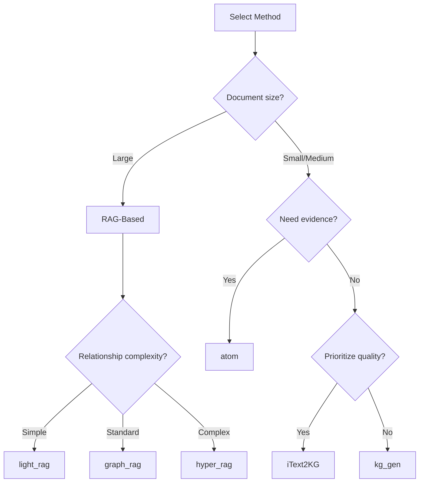

# 选择方法

了解提取方法以及何时使用每种方法。

---

## 什么是方法？

方法是驱动知识提取的底层算法。模板提供易于使用、特定领域的配置，而方法让您直接访问提取算法。

---

## 方法类别

### 基于 RAG 的方法

**检索增强生成**方法通过结合检索与生成，在处理大型文档方面表现出色。

| 方法 | 最佳用途 | 关键特性 |
|--------|----------|-------------|
| `light_rag` | 通用用途 | 快速、轻量 |
| `graph_rag` | 大型文档 | 社区检测 |
| `hyper_rag` | 复杂关系 | N 元超边 |
| `hypergraph_rag` | 高级场景 | 增强超图谱 |
| `cog_rag` | 推理任务 | 认知检索 |

### 典型方法

**直接提取**方法，无需检索即可处理文本。

| 方法 | 最佳用途 | 关键特性 |
|--------|----------|-------------|
| `itext2kg` | 质量优先 | 高质量三元组 |
| `itext2kg_star` | 增强质量 | 改进的 iText2KG |
| `kg_gen` | 灵活性 | 可配置生成 |
| `atom` | 时序数据 | 证据归属 |

---

## 使用方法

### 基本用法

```python
from hyperextract import Template

# 从方法创建
ka = Template.create("method/light_rag")

# 提取
result = ka.parse(text)
```

### 使用自定义客户端

```python
from langchain_openai import ChatOpenAI, OpenAIEmbeddings
from hyperextract import Template

llm = ChatOpenAI(model="gpt-4o")
emb = OpenAIEmbeddings(model="text-embedding-3-large")

ka = Template.create(
    "method/graph_rag",
    llm_client=llm,
    embedder=emb
)
```

---

## 方法选择指南

### 决策树



### 按用例

#### 快速提取（小文档）

```python
# 快速简单
ka = Template.create("method/kg_gen")
```

#### 高质量结果

```python
# 最佳提取质量
ka = Template.create("method/itext2kg_star")
```

#### 大型文档

```python
# 高效处理
ka = Template.create("method/light_rag")
```

#### 复杂关系

```python
# 多实体关系
ka = Template.create("method/hyper_rag")
```

#### 时序分析

```python
# 带证据的基于时间的方法
ka = Template.create("method/atom")
```

---

## RAG vs 典型方法比较

| 功能 | 基于 RAG | 典型方法 |
|---------|-----------|--------|
| **文档大小** | 大型（10k+ 词） | 小型-中型 |
| **速度** | 较慢（检索步骤） | 较快 |
| **内存** | 较高 | 较低 |
| **质量** | 大型文档良好 | 小型文档更好 |
| **上下文处理** | 优秀 | 良好 |
| **用例** | 书籍、论文、报告 | 文章、摘要 |

---

## 方法详情

### light_rag

最佳用途：通用、快速提取

```python
ka = Template.create("method/light_rag")

# 特点：
# - 最快的 RAG 方法
# - 二元边（source-target）
# - 速度/质量的良好平衡
```

### graph_rag

最佳用途：具有社区结构的大型文档

```python
ka = Template.create("method/graph_rag")

# 特点：
# - 社区检测
# - 层次化摘要
# - 最适合非常大的文档
```

### hyper_rag

最佳用途：复杂多实体关系

```python
ka = Template.create("method/hyper_rag")

# 特点：
# - 超边（连接 2+ 个实体）
# - 捕获复杂关系
# - 更丰富的图谱结构
```

### itext2kg

最佳用途：高质量三元组提取

```python
ka = Template.create("method/itext2kg")

# 特点：
# - 针对三元组质量优化
# - 迭代精炼
# - 适合知识库构建
```

### atom

最佳用途：带证据的时序分析

```python
ka = Template.create("method/atom")

# 特点：
# - 时序事实提取
# - 证据归属
# - 置信度评分
```

---

## 列出方法

```python
from hyperextract import Template
from hyperextract.methods import list_methods

# 列出所有方法
methods = list_methods()
for name, info in methods.items():
    print(f"{name}: {info['description']}")
    print(f"  Type: {info['type']}")
```

---

## 方法配置

方法可以通过参数配置：

```python
from hyperextract import Template

# 大多数方法使用默认配置
# 高级用户可以直接创建方法实例
from hyperextract.methods import Light_RAG
from langchain_openai import ChatOpenAI, OpenAIEmbeddings

llm = ChatOpenAI()
emb = OpenAIEmbeddings()

ka = Light_RAG(
    llm_client=llm,
    embedder=emb,
    # 方法特定参数
    chunk_size=1024,
    max_workers=5
)
```

---

## 最佳实践

1. **从 light_rag 开始** — 大多数情况的良好默认值
2. **使用 itext2kg 保证质量** — 当提取质量至关重要时
3. **复杂数据尝试 hyper_rag** — 当关系多方面时
4. **时序数据考虑 atom** — 当时间重要时
5. **在数据上基准测试** — 方法在不同内容上表现不同

---

## 何时使用模板 vs 方法

| 场景 | 建议 |
|----------|----------------|
| 快速开始 | 模板 |
| 特定领域任务 | 模板 |
| 生产系统 | 模板 |
| 研究/实验 | 方法 |
| 自定义需求 | 方法 |
| 性能优化 | 方法 |
| 完全控制 | 方法 |

---

## 另请参见

- [使用模板](using-templates.md)
- [模板库](../../templates/index.md)
- [方法概念文档](../../concepts/methods.md)
