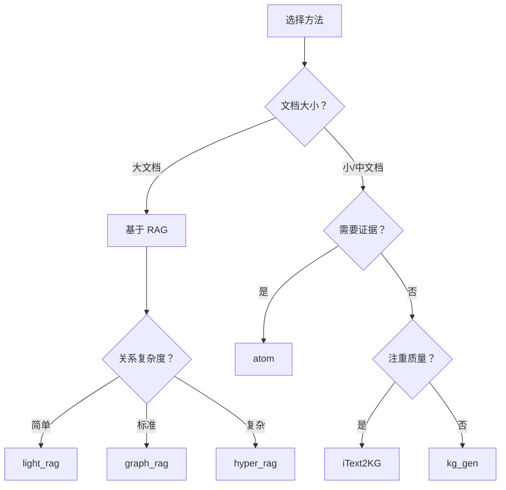

# 使用方法

!!! tip "Level 1 入门"
    本指南适合初学者。阅读本指南前，请先完成 [快速入门](../quickstart.md) 和 [使用模板](using-templates.md)。

了解 Hyper-Extract 的提取方法，以及如何在 `Template.create` 中快速切换不同算法。

---

## 什么是方法？

**方法（Method）** 是驱动知识提取的底层算法。在 Hyper-Extract 中，方法和模板一样，都可以通过 `Template.create` 直接调用：

```python
# 使用模板
ka = Template.create("general/biography_graph", language="zh")

# 使用方法
ka = Template.create("method/light_rag")
```

区别在于：
- **模板** = 预配置好的领域方案（结构 + 提示 + 语言）
- **方法** = 纯提取算法，更轻量，适合需要切换不同算法的场景

---

## 方法类别

### 典型方法

**直接提取**方法，无需检索即可处理文本。

| 方法 | 最佳用途 | 关键特性 |
|--------|----------|-------------|
| `itext2kg` | 质量优先 | 高质量三元组 |
| `itext2kg_star` | 增强质量 | 改进的 iText2KG |
| `kg_gen` | 灵活性 | 可配置生成 |
| `atom` | 时序数据 | 证据归属 |

### 基于 RAG 的方法

**检索增强生成**方法通过结合检索与生成，在处理大型文档方面表现出色。

| 方法 | 最佳用途 | 关键特性 |
|--------|----------|-------------|
| `light_rag` | 通用用途 | 快速、轻量 |
| `graph_rag` | 大型文档 | 社区检测 |
| `hyper_rag` | 复杂关系 | N 元超边 |
| `hypergraph_rag` | 高级场景 | 增强超图谱 |
| `cog_rag` | 推理任务 | 认知检索 |

---

## 基本用法

### 默认配置

```python
from hyperextract import Template

# 创建并提取
ka = Template.create("method/light_rag")
result = ka.parse(text)
```

### 使用自定义客户端

```python
from langchain_openai import ChatOpenAI, OpenAIEmbeddings
from hyperextract import Template

llm = ChatOpenAI(model="gpt-4o")
emb = OpenAIEmbeddings(model="text-embedding-3-large")

ka = Template.create(
    "method/graph_rag",
    llm_client=llm,
    embedder=emb
)
```

---

## 方法选择指南

### 决策树



### 按用例推荐

#### 快速提取（小文档）

```python
# 快速简单
ka = Template.create("method/kg_gen")
```

#### 高质量结果

```python
# 最佳提取质量
ka = Template.create("method/itext2kg_star")
```

#### 大型文档

```python
# 高效处理
ka = Template.create("method/light_rag")
```

#### 复杂关系

```python
# 多实体关系
ka = Template.create("method/hyper_rag")
```

#### 时序分析

```python
# 带证据的时序方法
ka = Template.create("method/atom")
```

---

## RAG vs 典型方法比较

| 功能 | 基于 RAG | 典型方法 |
|---------|-----------|--------|
| **文档大小** | 大型（10k+ 词） | 小型-中型 |
| **速度** | 较慢（检索步骤） | 较快 |
| **内存** | 较高 | 较低 |
| **质量** | 大型文档良好 | 小型文档更好 |
| **上下文处理** | 优秀 | 良好 |
| **用例** | 书籍、论文、报告 | 文章、摘要 |

---

## 方法速查

### itext2kg

最佳用途：高质量三元组提取

```python
ka = Template.create("method/itext2kg")

# 特点：
# - 针对三元组质量优化
# - 迭代精炼
# - 适合知识库构建
```

### itext2kg_star

最佳用途：增强质量提取

```python
ka = Template.create("method/itext2kg_star")

# 特点：
# - 提高提取质量
# - 更好地处理复杂情况
# - 增强的实体链接
```

### kg_gen

最佳用途：灵活、可配置提取

```python
ka = Template.create("method/kg_gen")

# 特点：
# - 可配置的生成
# - 灵活的 schema
# - 快速处理
```

### atom

最佳用途：带证据的时序分析

```python
ka = Template.create("method/atom")

# 特点：
# - 时序事实提取
# - 证据归属
# - 置信度评分
```

### light_rag

最佳用途：通用、快速提取

```python
ka = Template.create("method/light_rag")

# 特点：
# - 最快的 RAG 方法
# - 二元边（source-target）
# - 速度/质量的良好平衡
```

### graph_rag

最佳用途：具有社区结构的大型文档

```python
ka = Template.create("method/graph_rag")

# 特点：
# - 社区检测
# - 层次化摘要
# - 最适合非常大的文档
```

### hyper_rag

最佳用途：复杂多实体关系

```python
ka = Template.create("method/hyper_rag")

# 特点：
# - 超边（连接 2+ 个实体）
# - 捕获复杂关系
# - 更丰富的图谱结构
```

---

## 列出可用方法

```python
from hyperextract import Template
from hyperextract.methods import list_methods

# 列出所有方法
methods = list_methods()
for name, info in methods.items():
    print(f"{name}: {info['description']}")
    print(f"  类型: {info['type']}")
```

---

## 最佳实践

1. **从 light_rag 开始** — 大多数情况的良好默认值
2. **使用 itext2kg 保证质量** — 当提取质量至关重要时
3. **复杂数据尝试 hyper_rag** — 当关系多方面时
4. **时序数据考虑 atom** — 当时间重要时
5. **在数据上基准测试** — 方法在不同内容上表现不同

---

## 另请参见

**前置知识：**
- [使用模板](using-templates.md) — Level 1: 开箱即用的领域方案

**下一步：**
- [使用自动类型](working-with-autotypes.md) — Level 2: 自定义 schema 和提取配置
- [创建自定义模板](custom-templates.md) — 将你的自定义配置打包成可复用模板

**参考：**
- [方法概念文档](../../concepts/methods.md) — 详细算法解释
- [模板库](../../templates/index.md) — 浏览现有模板
