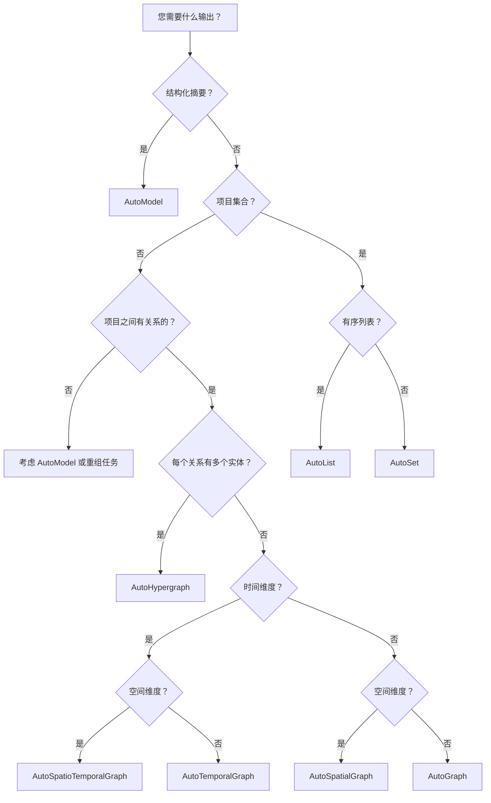

# 按输出类型选择

根据您需要的输出类型选择模板。

---

## 决策树



---

## AutoModel — 结构化摘要

**适用场景：** 需要结构化报告或摘要

**输出：** 带有字段的单个结构化对象

**示例：**
- 财务收益摘要
- 患者出院摘要
- 产品目录条目

**模板：**

| 模板 | 领域 |
|------|------|
| `general/model` | 通用 |
| `finance/earnings_summary` | 财务报告 |
| `medicine/discharge_instruction` | 医疗 |
| `tcm/herb_property` | 中医 |

**示例：**
```python
from hyperextract import Template

ka = Template.create("finance/earnings_summary", "zh")
result = ka.parse(earnings_report)

print(result.data.revenue)      # 1000000
print(result.data.eps)          # 2.50
print(result.data.yoy_growth)   # 15.3
```

---

## AutoList — 有序集合

**适用场景：** 需要有序列表

**输出：** 可能包含重复项的有序列表

**示例：**
- 合规清单（按重要性排序）
- 分步程序
- 排名项目

**模板：**

| 模板 | 领域 |
|------|------|
| `general/list` | 通用 |
| `legal/compliance_list` | 法律合规 |
| `legal/contract_obligation` | 合同义务 |
| `medicine/symptom_list` | 医疗症状 |

**示例：**
```python
ka = Template.create("legal/compliance_list", "zh")
result = ka.parse(contract_text)

for item in result.data.items:
    print(f"{item.priority}: {item.description}")
```

---

## AutoSet — 唯一集合

**适用场景：** 需要无序的唯一项目

**输出：** 唯一项目的集合

**示例：**
- 风险因素（唯一类别）
- 合同中的定义术语
- 关键概念

**模板：**

| 模板 | 领域 |
|------|------|
| `general/set` | 通用 |
| `finance/risk_factor_set` | 财务风险 |
| `legal/defined_term_set` | 法律术语 |

**示例：**
```python
ka = Template.create("finance/risk_factor_set", "zh")
result = ka.parse(filing_text)

for risk in result.data.items:
    print(f"{risk.category}: {risk.description}")
```

---

## AutoGraph — 实体网络

**适用场景：** 需要二元关系（A → B）

**输出：** 带有实体和二元边的图

**示例：**
- 知识图谱
- 概念地图
- 社交网络
- 股权结构

**模板：**

| 模板 | 领域 |
|------|------|
| `general/graph` | 通用 |
| `general/graph` | 领域知识 |
| `general/concept_graph` | 研究概念 |
| `finance/ownership_graph` | 公司股权 |
| `medicine/anatomy_graph` | 解剖学 |

**示例：**
```python
ka = Template.create("general/concept_graph", "zh")
result = ka.parse(paper_text)

# 访问实体
for node in result.nodes:
    print(f"概念: {node.name} ({node.type})")

# 访问关系
for edge in result.edges:
    print(f"{edge.source} → {edge.target}: {edge.type}")
```

---

## AutoTemporalGraph — 时间线 + 网络

**适用场景：** 需要随时间变化的关系

**输出：** 带有时间标注边的图

**示例：**
- 传记和生平事件
- 案例年表
- 事件序列

**模板：**

| 模板 | 领域 |
|------|------|
| `general/base_temporal_graph` | 通用 |
| `general/biography_graph` | 人物生平 |
| `finance/event_timeline` | 财务事件 |
| `legal/case_fact_timeline` | 法律案例时间线 |
| `medicine/hospital_timeline` | 患者时间线 |

**示例：**
```python
ka = Template.create("general/biography_graph", "zh")
result = ka.parse(biography_text)

# 构建索引用于可视化
result.build_index()
result.show()  # 交互式时间线视图

# 按时间查询
response = result.chat("1080年到1090年间发生了什么？")
```

---

## AutoSpatialGraph — 位置 + 网络

**适用场景：** 需要地理/空间关系

**输出：** 带有位置标注实体的图

**示例：**
- 地理网络
- 基于位置的系统
- 空间拓扑

**模板：**

| 模板 | 领域 |
|------|------|
| `general/base_spatial_graph` | 通用 |

---

## AutoSpatioTemporalGraph — 时间 + 空间 + 网络

**适用场景：** 需要时间和位置两个维度

**输出：** 带有时间和空间标注的图

**示例：**
- 带位置的历史事件
- 移动追踪
- 随时间变化的地理政治

**模板：**

| 模板 | 领域 |
|------|------|
| `general/base_spatio_temporal_graph` | 通用 |

---

## AutoHypergraph — 复杂关系

**适用场景：** 需要连接 2+ 实体的关系

**输出：** 带有 n 元超边的超图

**示例：**
- 多方合同
- 复杂化学反应
- 会议论文（多位作者）

**模板：**

| 模板 | 领域 |
|------|------|
| `general/base_hypergraph` | 通用 |

**注意：** 超图是高级功能。大多数用例可以用 AutoGraph 满足。

---

## 快速参考

| 输出类型 | 自动类型 | 适用场景 |
|---------|---------|---------|
| 结构化报告 | AutoModel | 需要带字段的摘要 |
| 有序列表 | AutoList | 项目有优先级/顺序 |
| 唯一项目 | AutoSet | 需要去重集合 |
| 二元网络 | AutoGraph | A 与 B 的关系 |
| 时间线网络 | AutoTemporalGraph | 随时间的事件 |
| 地理网络 | AutoSpatialGraph | 基于位置的关系 |
| 时间 + 空间网络 | AutoSpatioTemporalGraph | 需要两个维度 |
| 复杂关系 | AutoHypergraph | 多实体关系 |

---

## 了解更多

- [自动类型概念指南](../../concepts/autotypes.md)
- [按任务选择](by-task.md)
- [模板概览](../reference/overview.md)
