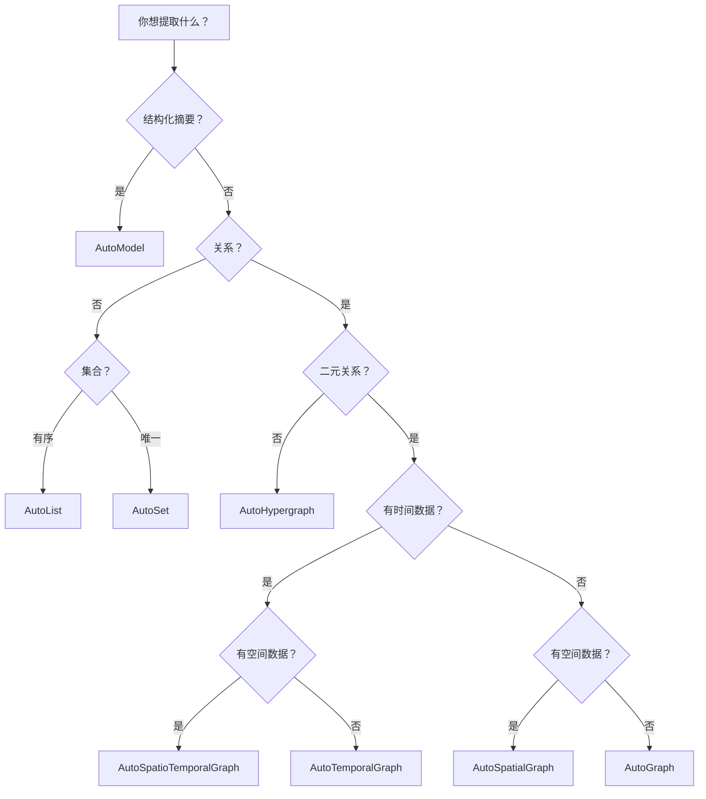

# 如何选择模板

选择合适模板的决策指南。

---

## 快速决策树



---

## 按用例

### 人物与传记

| 模板 | 输出 | 最适合 |
|------|------|--------|
| `general/biography_graph` | 时序图谱 | 生平故事、个人简介 |
| `general/base_model` | 模型 | 人物摘要 |

**示例：**
```bash
he parse bio.md -t general/biography_graph -l en -o ./out/
```

### 研究与文档

| 模板 | 输出 | 最适合 |
|------|------|--------|
| `general/concept_graph` | 图谱 | 研究论文 |
| `general/knowledge_graph` | 图谱 | 技术文档 |
| `general/doc_structure` | 模型 | 文档大纲 |

### 金融

| 模板 | 输出 | 最适合 |
|------|------|--------|
| `finance/earnings_summary` | 模型 | 财报 |
| `finance/ownership_graph` | 图谱 | 公司结构 |
| `finance/event_timeline` | 时序 | 金融事件 |
| `finance/risk_factor_set` | 集合 | 风险评估 |

### 法律

| 模板 | 输出 | 最适合 |
|------|------|--------|
| `legal/contract_obligation` | 列表 | 合同条款 |
| `legal/case_citation` | 图谱 | 法律先例 |
| `legal/case_fact_timeline` | 时序 | 案件时间线 |

### 医疗

| 模板 | 输出 | 最适合 |
|------|------|--------|
| `medicine/anatomy_graph` | 图谱 | 解剖文本 |
| `medicine/drug_interaction` | 图谱 | 药物信息 |
| `medicine/treatment_map` | 图谱 | 治疗方案 |

---

## 按输出类型

### 我需要摘要/报告 → AutoModel

```python
# 财务摘要
ka = Template.create("finance/earnings_summary", "en")

# 患者出院
ka = Template.create("medicine/discharge_instruction", "en")
```

### 我需要列表 → AutoList

```python
# 合规清单
ka = Template.create("legal/compliance_list", "en")

# 症状
ka = Template.create("medicine/symptom_list", "en")
```

### 我需要唯一项目 → AutoSet

```python
# 风险因素
ka = Template.create("finance/risk_factor_set", "en")

# 关键术语
ka = Template.create("legal/defined_term_set", "en")
```

### 我需要网络 → AutoGraph

```python
# 通用知识
ka = Template.create("general/knowledge_graph", "en")

# 公司所有权
ka = Template.create("finance/ownership_graph", "en")
```

### 我需要时间线 → AutoTemporalGraph

```python
# 传记
ka = Template.create("general/biography_graph", "en")

# 事件序列
ka = Template.create("finance/event_timeline", "en")
```

---

## 按文档语言

### 英文文档

所有模板都支持英文：

```bash
he parse doc.md -t general/biography_graph -l en
```

### 中文文档

所有模板都支持中文：

```bash
he parse doc.md -t general/biography_graph -l zh
```

**提示：** 使用与文档相匹配的语言以获得最佳效果。

---

## 按文档大小

### 短文档（< 1000 词）

任何模板都可以。考虑：
- 摘要使用 AutoModel
- 关系使用 AutoGraph

### 中等文档（1000-5000 词）

大多数模板都适用：
- 传记图谱
- 概念图谱
- 知识图谱

### 长文档（> 5000 词）

考虑分块或使用 RAG 方法：
- 使用 `method/light_rag`
- 或将文档分成多个部分

---

## 场景示例

### 场景 1：研究论文分析

**需求：** 提取关键概念及其关系

**解决方案：**
```bash
he parse paper.md -t general/concept_graph -l en -o ./paper_kb/
```

### 场景 2：财务报告

**需求：** 提取财报指标

**解决方案：**
```bash
he parse 10k.md -t finance/earnings_summary -l en -o ./earnings/
```

### 场景 3：法律合同

**需求：** 提取义务和截止日期

**解决方案：**
```bash
he parse contract.md -t legal/contract_obligation -l en -o ./contract/
```

### 场景 4：医疗案例

**需求：** 跟踪患者时间线

**解决方案：**
```bash
he parse case.md -t medicine/hospital_timeline -l en -o ./case/
```

---

## 何时使用方法代替

模板不适合您的需求？直接使用方法：

```python
# 大文档
ka = Template.create("method/graph_rag")

# 特定算法
ka = Template.create("method/itext2kg")
```

→ [选择方法](../python/guides/choosing-methods.md)

---

## 获取帮助

### 列出所有模板

```bash
he list template
```

### 搜索模板

```python
from hyperextract import Template

# 按关键词搜索
results = Template.list(filter_by_query="finance")
```

### 检查模板详情

```python
cfg = Template.get("general/biography_graph")
print(cfg.description)
```

---

## 参见

- [浏览所有模板](browse.md)
- [模板库](index.md)
- [自定义模板](../python/guides/custom-templates.md)
